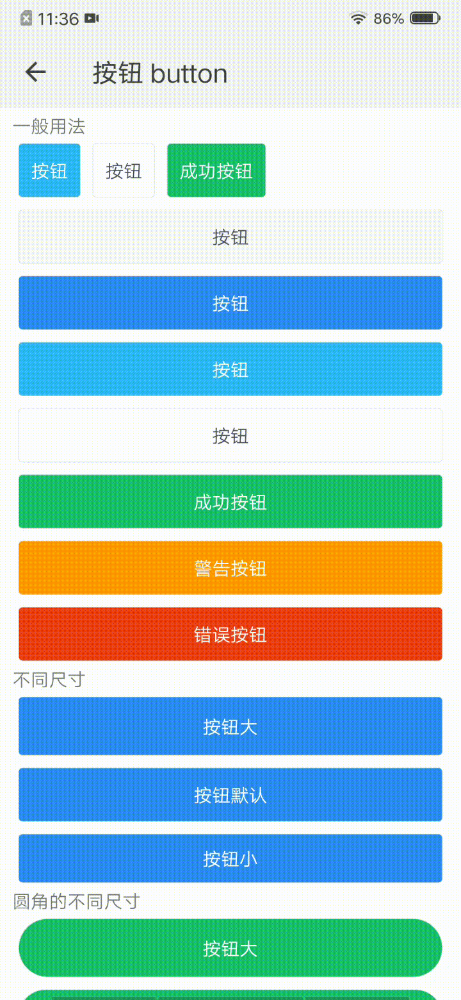

## 按钮 button

### 描述

用于各类业务逻辑场景的基础组件。

### 使用效果

<div style="text-align: center;margin: 40px;"></div>

### 使用方法

在`.ux`文件中引入组件

```html
<import name="my-button" src="@apex-quickapp/components/button/index"></import>
```

### 示例

```html
<template>
    <div class="wrap">
        <text class="title">一般用法</text>
        <div class="inline">
            <my-button type="info" inline="true">按钮</my-button>
            <my-button type="ghost" inline="true">按钮</my-button>
            <my-button type="success" inline="true">成功按钮</my-button>
        </div>
        <my-button type="default" ontap="tap">按钮</my-button>
        <my-button type="primary">按钮</my-button>
        <my-button type="info">按钮</my-button>
        <my-button type="ghost">按钮</my-button>
        <my-button type="success">成功按钮</my-button>
        <my-button type="warning">警告按钮</my-button>
        <my-button type="error">错误按钮</my-button>
        <text class="title">不同尺寸</text>
        <my-button type="primary" size="large">按钮大</my-button>
        <my-button type="primary" size="default">按钮默认</my-button>
        <my-button type="primary" size="small">按钮小</my-button>
        <text class="title">圆角的不同尺寸</text>
        <my-button type="success" shape="circle" size="large">按钮大</my-button>
        <my-button type="success" shape="circle" size="default">按钮默认</my-button>
        <my-button type="success" shape="circle" size="small">按钮小</my-button>
        <my-button type="primary" loading="true">加载中按钮</my-button>
        <my-button type="ghost" disabled="true">禁用按钮</my-button>
    </div>
</template>
```

```less
.wrap {
    flex-direction: column;
    padding: 10px 20px;
    .inline {
        flex-direction: row;
    }
}
```

### API

#### 组件属性

| 属性     | 类型    | 默认值  | 说明                                                         |
| -------- | ------- | ------- | ------------------------------------------------------------ |
| type     | String  | default | 按钮类型，可选值有default, primary, ghost, info, success, warning, error |
| inline   | Boolean | false   | 按钮是否内联                                                 |
| loading  | Boolean | false   | 按钮是否处于加载中                                           |
| disabled | Boolean | false   | 按钮是否被禁用                                               |
| size     | String  | default | 按钮大小，可选值有large, default, small                      |
| shape    | String  | square  | 按钮形状，可选值有circle, square                             |

#### 组件事件

| 事件名称 | 事件描述 | 返回值 |
| -------- | -------- | ------ |
| tap      | 按钮点击 | -      |

