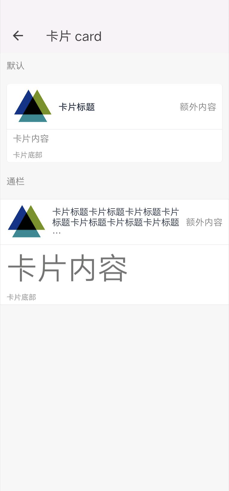

## 卡片 card

### 描述

用于显示卡片等集中视图信息

### 使用效果

<div style="text-align: center;margin: 40px;"></div>


### 使用方法

在`.ux`文件中引入组件

```html
<import name="my-card" src="@apex-quickapp/components/card/index"></import>
```

### 示例

```html
<template>
    <div class="wrap">
        <text class="title">默认</text>
        <my-card title="卡片标题" thumb="/assets/images/logo-d.png" extra="额外内容" footer="卡片底部">
            <text>卡片内容</text>
        </my-card>
        <text class="title">通栏</text>
        <my-card title="卡片标题卡片标题卡片标题卡片标题卡片标题卡片标题卡片标题卡片标题" full="true" thumb="/assets/images/logo-d.png" extra="额外内容" footer="卡片底部">
            <text class="demo">卡片内容</text>
        </my-card>
    </div>
</template>
```

```less
.wrap {
    background-color: #f7f7f7;
    flex-direction: column;
    .title {
        padding: 20px;
    }
}
.demo{
    font-size: 100px;
}
```

### API

#### 组件属性

| 属性   | 类型    | 默认值 | 说明             |
| ------ | ------- | ------ | ---------------- |
| full   | Boolean | false  | 卡片视图是否联通 |
| title  | String  | -      | 卡片标题         |
| thumb  | String  | -      | 卡片的图片       |
| extra  | String  | -      | 卡片的额外信息   |
| footer | String  | -      | 卡片底部内容     |