## 图表 charts

### 描述

来源于 [wx-charts](https://github.com/xiaolin3303/wx-charts)

基于 canvas 绘制，体积小巧，目前兼容版本存在问题，重构版本正在开发中，尽请期待。

### 支持的图表类型

- 饼图 pie
- 圆环图 ring
- 线图 line
- 柱状图 column
- 区域图 area
- 雷达图 radar

### 参数说明

| 属性                           | 类型     | 必填 | 默认值   | 说明                                                                                                              |
| ------------------------------ | -------- | ---- | -------- | ----------------------------------------------------------------------------------------------------------------- |
| options                        | Object   | 必填 |          | 配置项                                                                                                            |
| options.element                | Object   | 必填 |          | canvas 对象，快应用中用 this.\$element('id')获取                                                                  |
| options.width                  | Number   | 必填 |          | canvas 宽度，单位为 px                                                                                            |
| options.height                 | Number   | 必填 |          | canvas 高度，单位为 px                                                                                            |
| options.backgroundColor        | String   |      | #ffffff  | canvas 背景颜色（如果页面背景颜色不是白色请设置为页面的背景颜色）                                                 |
| options.enableScroll           | Boolean  |      | false    | 是否开启图表可拖拽滚动, 支持 line, area 图表类型(需配合绑定 scrollStart, scroll, scrollEnd 方法)                  |
| options.title                  | Object   |      |          | 标题配置 (only for ring chart)                                                                                    |
| options.title.name             | String   |      |          | 标题内容                                                                                                          |
| options.title.fontSize         | Number   |      |          | 标题字体大小（可选，单位为 px）                                                                                   |
| options.title.color            | String   |      |          | 标题颜色（可选）                                                                                                  |
| options.title.offsetX          | Number   |      | 0        | 标题横向位置偏移量，单位 px                                                                                       |
| options.subtitle               | Object   |      |          | 副标题配置 (only for ring chart)                                                                                  |
| options.subtitle.name          | String   |      |          | 副标题内容                                                                                                        |
| options.subtitle.offsetX       | Number   |      | 0        | 副标题横向位置偏移量，单位 px                                                                                     |
| options.subtitle.fontSize      | Number   |      |          | 副标题字体大小（可选，单位为 px）                                                                                 |
| options.subtitle.color         | String   |      |          | 副标题颜色（可选）                                                                                                |
| options.animation              | Boolean  |      | true     | 是否动画展示                                                                                                      |
| options.legend                 | Boolean  |      | true     | 是否显示图表下方各类别的标识                                                                                      |
| options.type                   | String   | 必填 |          | 图表类型，可选值为 pie, line, column, area, ring, radar                                                           |
| options.categories             | Array    | 必填 |          | 数据类别分类 (饼图、圆环图不需要)                                                                                 |
| options.dataLabel              | Boolean  |      | true     | 是否在图表中显示数据内容值                                                                                        |
| options.dataPointShape         | Boolean  |      | true     | 是否在图表中显示数据点图形标识                                                                                    |
| options.disablePieStroke       | Boolean  |      | false    | 不绘制饼图（圆环图）各区块的白色分割线                                                                            |
| options.xAxis                  | Object   |      |          | X 轴配置                                                                                                          |
| options.xAxis.gridColor        | String   |      | #cccccc  | X 轴网格颜色                                                                                                      |
| options.xAxis.fontColor        | String   |      | #666666  | X 轴数据点颜色                                                                                                    |
| options.xAxis.disableGrid      | Boolean  |      | false    | 不绘制 X 轴网格                                                                                                   |
| options.xAxis.type             | String   |      |          | 可选值 calibration(刻度) 默认为包含样式                                                                           |
| options.yAxis                  | Object   |      |          | Y 轴配置                                                                                                          |
| options.yAxis.format           | Function |      |          | 自定义 Y 轴文案显示                                                                                               |
| options.yAxis.min              | Number   |      |          | Y 轴起始值                                                                                                        |
| options.yAxis.max              | Number   |      |          | Y 轴终止值                                                                                                        |
| options.yAxis.title            | String   |      |          | Y 轴 title                                                                                                        |
| options.yAxis.gridColor        | String   |      | #cccccc  | Y 轴网格颜色                                                                                                      |
| options.yAxis.fontColor        | String   |      | #666666  | Y 轴数据点颜色                                                                                                    |
| options.yAxis.titleFontColor   | String   |      | #333333  | Y 轴 title 颜色                                                                                                   |
| options.yAxis.disabled         | Boolean  |      | false    | 不绘制 Y 轴                                                                                                       |
| options.extra                  | Object   |      |          | 其他非通用配置项                                                                                                  |
| options.extra.ringWidth        | Number   |      |          | ringChart 圆环宽度，单位为 px                                                                                     |
| options.extra.lineStyle        | String   |      | straight | 可选值：curve 曲线，straight 直线 (仅对 line, area 图表有效)                                                      |
| options.extra.column           | Object   |      |          | 柱状图相关配置                                                                                                    |
| options.extra.column.width     | Number   |      |          | 柱状图每项的图形宽度，单位为 px                                                                                   |
| options.extra.legendTextColor  | String   |      | #ccccc   | legend 文案颜色                                                                                                   |
| options.extra.radar            | Object   |      |          | 雷达图相关配置                                                                                                    |
| options.extra.radar.max        | Number   |      |          | 数据区间最大值，用于调整数据显示的比例，默认为 series data 的最大值                                               |
| options.extra.radar.labelColor | String   |      | #666666  | 各项标识文案的颜色                                                                                                |
| options.extra.radar.gridColor  | String   |      | #cccccc  | 雷达图网格颜色                                                                                                    |
| options.extra.pie              | Object   |      |          | 饼图、圆环图相关配置                                                                                              |
| options.extra.pie.offsetAngle  | Number   |      | 0        | 起始角度偏移度数，顺时针方向，起点为 3 点钟位置（比如要设置起点为 12 点钟位置，即逆时针偏移 90 度，传入-90 即可） |
| options.series                 | Array    |      |          | 数据列表                                                                                                          |
| dataItem                       | Object   |      |          | 数据列表每项结构定义                                                                                              |
| dataItem.data                  | Array    | 必填 |          | 数据，如果传入 null 图表该处出现断点 (饼图、圆环图为 Number)                                                      |
| dataItem.color                 | String   |      |          | 不传入则使用系统默认配色方案                                                                                      |
| dataItem.name                  | String   |      |          | 数据名称                                                                                                          |
| dataItem.format                | Function |      |          | 自定义显示数据内容                                                                                                |

### 方法

| 方法名称                         | 方法描述                                                                                                                                                                                                                                                                                                                                                                   | 参数           |
| -------------------------------- | -------------------------------------------------------------------------------------------------------------------------------------------------------------------------------------------------------------------------------------------------------------------------------------------------------------------------------------------------------------------------- | -------------- |
| updateData(data)                 | 更新图表数据，data: object，data.categories(可选，具体见参数说明)，data.series(可选，具体见参数说明)，data.title(可选，具体见参数说明)，data.subtitle(可选，具体见参数说明)                                                                                                                                                                                                | data           |
| stopAnimation()                  | 停止当前正在进行的动画效果，直接展示渲染的最终结果                                                                                                                                                                                                                                                                                                                         |                |
| addEventListener(type, listener) | 添加事件监听，type: String 事件类型，listener: function 处理方法                                                                                                                                                                                                                                                                                                           | type, listener |
| getCurrentDataIndex(e)           | 获取图表中点击时的数据序列编号(-1 表示未找到对应的数据区域), e: Object 微信小程序标准事件，需要手动的去绑定 touch 事件，具体可参考 wx-charts-demo 中 column 图示例                                                                                                                                                                                                         | e              |
| showToolTip(e, options?)         | 图表中展示数据详细内容(目前仅支持 line 和 area 图表类型)，e: Object 微信小程序标准事件，options: Object 可选，tooltip 的自定义配置，支持 option.background，默认为#000000; option.format, function 类型，接受两个传入的参数，seriesItem(Object, 包括 seriesItem.name 以及 seriesItem.data)和 category，可自定义 tooltip 显示内容。具体可参考 wx-charts-demo 中 line 图示例 | e, options     |
| scrollStart(e)                   | 设置支持图表拖拽系列事件(支持 line, area, column)，具体参考 wx-charts-demo 中 ScrollLine 图示例                                                                                                                                                                                                                                                                            | e              |
| scroll(e)                        | 设置支持图表拖拽系列事件(支持 line, area, column)，具体参考 wx-charts-demo 中 ScrollLine 图示例                                                                                                                                                                                                                                                                            | e              |
| scrollEnd(e)                     | 设置支持图表拖拽系列事件(支持 line, area, column)，具体参考 wx-charts-demo 中 ScrollLine 图示例                                                                                                                                                                                                                                                                            | e              |

### 事件

| 事件名称       | 事件描述                                             | 返回值 |
| -------------- | ---------------------------------------------------- | ------ |
| renderComplete | 图表渲染完成（如果有动画效果，则动画效果完成时触发） |        |

### 使用方法

1. 在 script 中引入方法
2. 在 script 定义变量保存 Charts 实例，为避免堆栈溢出问题，请勿赋值给成员变量，参考 [快应用文档](https://doc.quickapp.cn/tutorial/framework/optimization-skills.html?h=%E5%A0%86%E6%A0%88%E6%BA%A2%E5%87%BA%E9%97%AE%E9%A2%98)
3. 定义图表绘制方法, 如果一个页面内存在多个图表会导致图表动画失效，可以使用 async, await 同步绘制各个图表，保证正常动画效果

```html
<script>
  import Charts from "apex-ui/components/charts/index";

  let $chart1 = "";
  let $chart2 = "";

  export default {
    async onShow() {
      await this.initChart1();
      await this.initChart2();
    },
    initChart1() {
      return new Promise((resolve, reject) => {
        $chart1 = new Charts({});

        $chart1.addEventListener("renderComplete", () => {
          console.log("chart1 renderComplete");
          resolve();
        });
      });
    },
    initChart2() {
      return new Promise((resolve, reject) => {
        $chart2 = new Charts({});

        $chart2.addEventListener("renderComplete", () => {
          console.log("chart2 renderComplete");
          resolve();
        });
      });
    }
  };
</script>
```

### 图表示例

### 饼图 pie

<div style="text-align: center; margin: 40px;">
  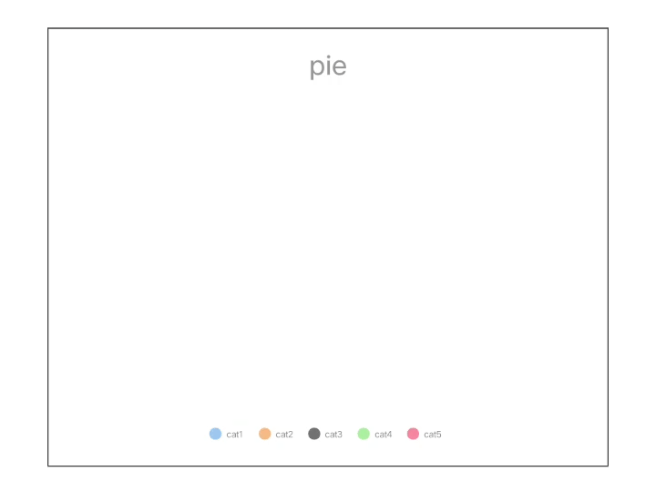
  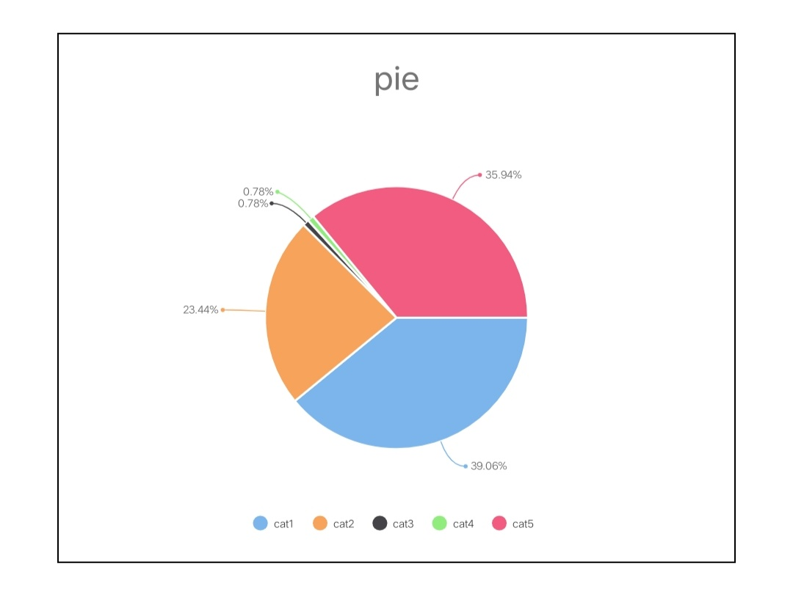
</div>

```html
<template>
  <div class="wrap">
    <div class="chart-wrap">
      <text class="title">pie</text>
      <canvas
        id="chartPie"
        class="chart"
        style="width: {{width}}px; height: {{height}}px;"
      ></canvas>
    </div>
  </div>
</template>
<style lang="less">
  .wrap {
    flex-direction: column;
    align-items: center;
    .chart-wrap {
      flex-direction: column;
      border: 1px solid #000;
      padding: 20px;
      margin-bottom: 20px;
      .title {
        font-size: 30px;
        font-weight: bold;
        text-align: center;
        margin-bottom: 20px;
      }
    }
  }
</style>
<script>
  import Charts from "apex-ui/components/charts/index";

  let $chartPie = "";

  export default {
    data() {
      return {
        width: 600,
        height: 400,
        backgroundColor: "#eee"
      };
    },
    async onShow() {
      await this.initChartPie();
    },
    initChartPie() {
      return new Promise((resolve, reject) => {
        $chartPie = new Charts({
          element: this.$element("chartPie"),
          type: "pie",
          width: this.width,
          height: this.height,
          backgroundColor: this.backgroundColor,
          animation: true,
          series: [
            {
              name: "cat1",
              data: 50
            },
            {
              name: "cat2",
              data: 30
            },
            {
              name: "cat3",
              data: 1
            },
            {
              name: "cat4",
              data: 1
            },
            {
              name: "cat5",
              data: 46
            }
          ]
        });

        $chartPie.addEventListener("renderComplete", () => {
          console.log("chartPie renderComplete");
          resolve();
        });
      });
    }
  };
</script>
```

### 圆环图 ring

<div style="text-align: center; margin: 40px;">
  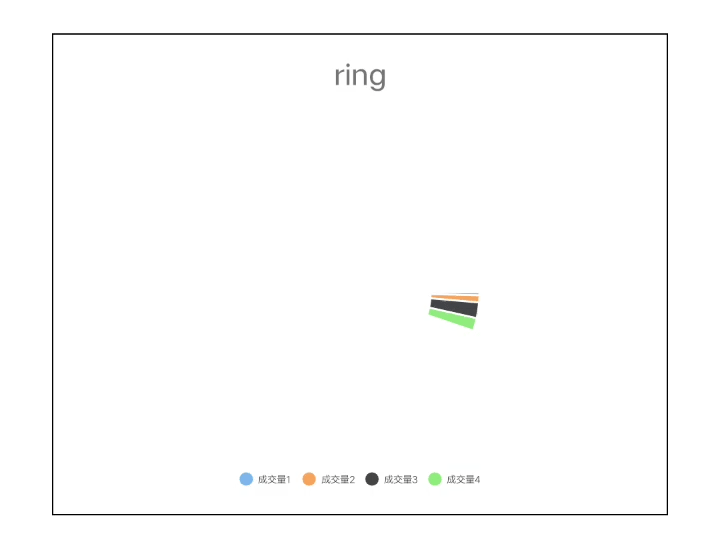
  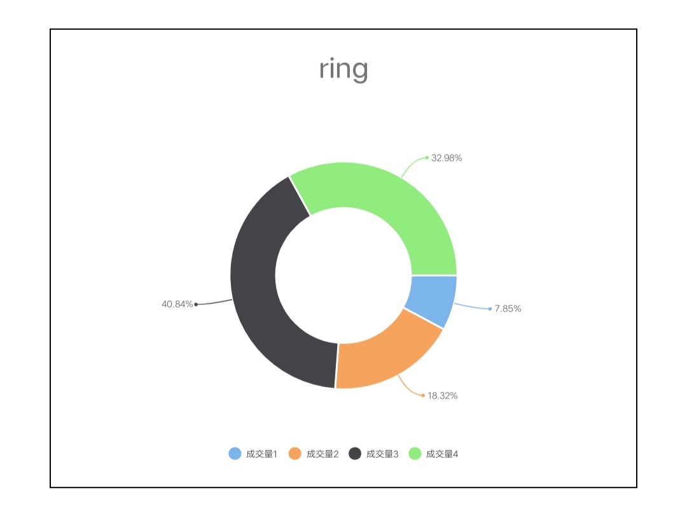
</div>

```html
<template>
  <div class="wrap">
    <div class="chart-wrap">
      <text class="title">ring</text>
      <canvas
        id="chartRing"
        class="chart"
        style="width: {{width}}px; height: {{height}}px;"
      ></canvas>
    </div>
  </div>
</template>
<style lang="less">
  .wrap {
    flex-direction: column;
    align-items: center;
    .chart-wrap {
      flex-direction: column;
      border: 1px solid #000;
      padding: 20px;
      margin-bottom: 20px;
      .title {
        font-size: 30px;
        font-weight: bold;
        text-align: center;
        margin-bottom: 20px;
      }
    }
  }
</style>
<script>
  import Charts from "apex-ui/components/charts/index";

  let $chartRing = "";

  export default {
    data() {
      return {
        width: 600,
        height: 400,
        backgroundColor: "#eee"
      };
    },
    async onShow() {
      await this.initChartPie();
    },
    initChartRing() {
      return new Promise((resolve, reject) => {
        $chartRing = new Charts({
          element: this.$element("chartRing"),
          type: "ring",
          width: this.width,
          height: this.height,
          backgroundColor: this.backgroundColor,
          animation: true,
          series: [
            {
              name: "成交量1",
              data: 15
            },
            {
              name: "成交量2",
              data: 35
            },
            {
              name: "成交量3",
              data: 78
            },
            {
              name: "成交量4",
              data: 63
            }
          ]
        });

        $chartRing.addEventListener("renderComplete", () => {
          console.log("chartRing renderComplete");
          resolve();
        });
      });
    }
  };
</script>
```

### 线图 line

<div style="text-align: center; margin: 40px;">
  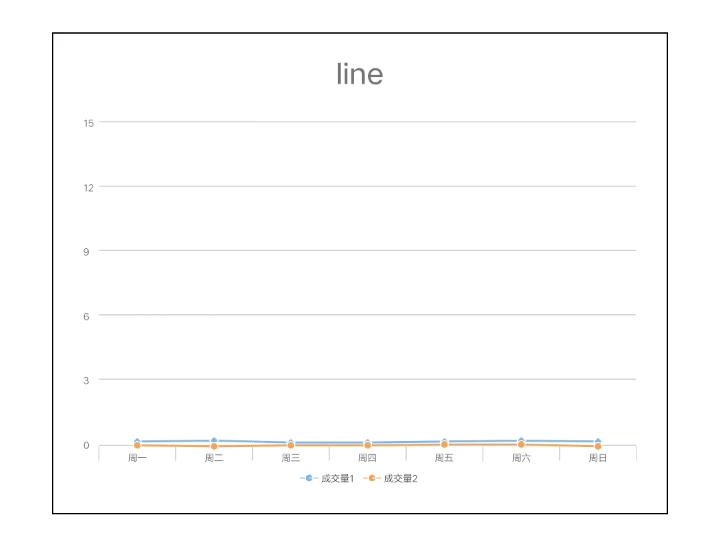
  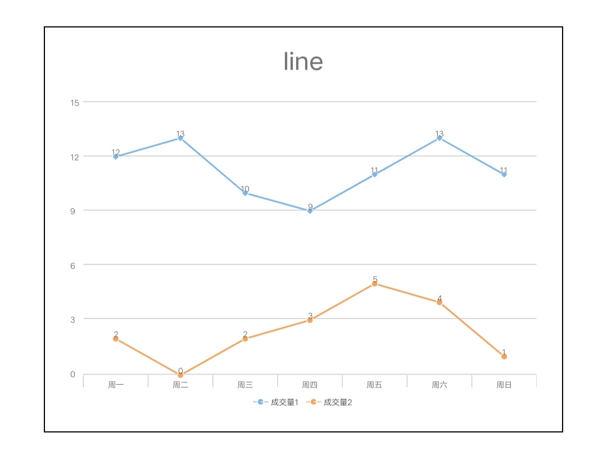
</div>

```html
<template>
  <div class="wrap">
    <div class="chart-wrap">
      <text class="title">line</text>
      <canvas
        id="chartLine"
        class="chart"
        style="width: {{width}}px; height: {{height}}px;"
      ></canvas>
    </div>
  </div>
</template>
<style lang="less">
  .wrap {
    flex-direction: column;
    align-items: center;
    .chart-wrap {
      flex-direction: column;
      border: 1px solid #000;
      padding: 20px;
      margin-bottom: 20px;
      .title {
        font-size: 30px;
        font-weight: bold;
        text-align: center;
        margin-bottom: 20px;
      }
    }
  }
</style>
<script>
  import Charts from "apex-ui/components/charts/index";

  let $chartLine = "";

  export default {
    data() {
      return {
        width: 600,
        height: 400,
        backgroundColor: "#eee"
      };
    },
    async onShow() {
      await this.initChartLine();
    },
    initChartLine() {
      return new Promise((resolve, reject) => {
        $chartLine = new Charts({
          element: this.$element("chartLine"),
          type: "line",
          width: this.width,
          height: this.height,
          backgroundColor: this.backgroundColor,
          animation: true,
          categories: ["周一", "周二", "周三", "周四", "周五", "周六", "周日"],
          series: [
            {
              name: "成交量1",
              data: [12, 13, 10, 9, 11, 13, 11]
            },
            {
              name: "成交量2",
              data: [2, 0, 2, 3, 5, 4, 1]
            }
          ]
        });

        $chartLine.addEventListener("renderComplete", () => {
          console.log("chartLine renderComplete");
          resolve();
        });
      });
    }
  };
</script>
```

### 柱状图 column

<div style="text-align: center; margin: 40px;">
  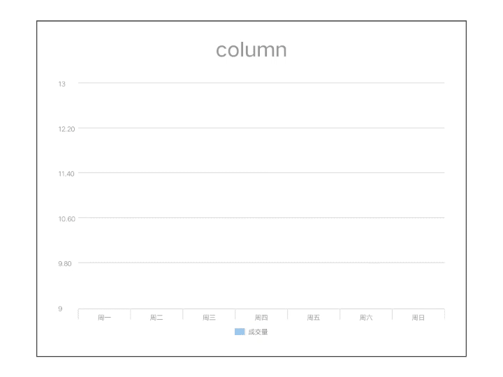
  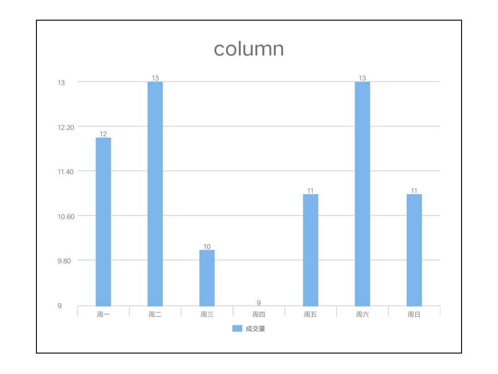
</div>

```html
<template>
  <div class="wrap">
    <div class="chart-wrap">
      <text class="title">column</text>
      <canvas
        id="chartColumn"
        class="chart"
        style="width: {{width}}px; height: {{height}}px;"
      ></canvas>
    </div>
  </div>
</template>
<style lang="less">
  .wrap {
    flex-direction: column;
    align-items: center;
    .chart-wrap {
      flex-direction: column;
      border: 1px solid #000;
      padding: 20px;
      margin-bottom: 20px;
      .title {
        font-size: 30px;
        font-weight: bold;
        text-align: center;
        margin-bottom: 20px;
      }
    }
  }
</style>
<script>
  import Charts from "apex-ui/components/charts/index";

  let $chartColumn = "";

  export default {
    data() {
      return {
        width: 600,
        height: 400,
        backgroundColor: "#eee"
      };
    },
    async onShow() {
      await this.initChartColumn();
    },
    initChartColumn() {
      return new Promise((resolve, reject) => {
        $chartColumn = new Charts({
          element: this.$element("chartColumn"),
          type: "column",
          width: this.width,
          height: this.height,
          backgroundColor: this.backgroundColor,
          animation: true,
          categories: ["周一", "周二", "周三", "周四", "周五", "周六", "周日"],
          series: [
            {
              name: "成交量",
              data: [12, 13, 10, 9, 11, 13, 11]
            }
          ]
        });

        $chartColumn.addEventListener("renderComplete", () => {
          console.log("chartColumn renderComplete");
          resolve();
        });
      });
    }
  };
</script>
```

### 区域图 area

<div style="text-align: center; margin: 40px;">
  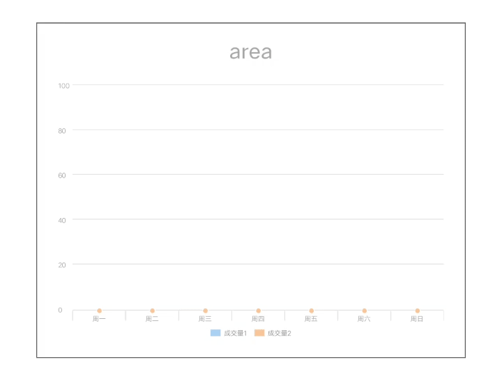
  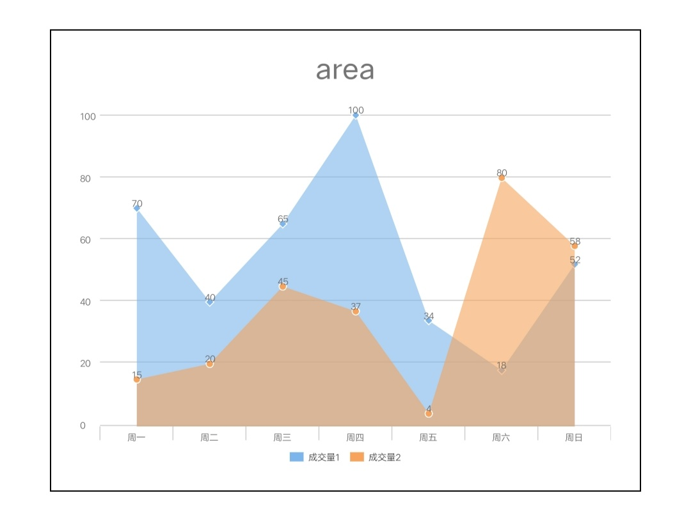
</div>

```html
<template>
  <div class="wrap">
    <div class="chart-wrap">
      <text class="title">area</text>
      <canvas
        id="chartArea"
        class="chart"
        style="width: {{width}}px; height: {{height}}px;"
      ></canvas>
    </div>
  </div>
</template>
<style lang="less">
  .wrap {
    flex-direction: column;
    align-items: center;
    .chart-wrap {
      flex-direction: column;
      border: 1px solid #000;
      padding: 20px;
      margin-bottom: 20px;
      .title {
        font-size: 30px;
        font-weight: bold;
        text-align: center;
        margin-bottom: 20px;
      }
    }
  }
</style>
<script>
  import Charts from "apex-ui/components/charts/index";

  let $chartArea = "";

  export default {
    data() {
      return {
        width: 600,
        height: 400,
        backgroundColor: "#eee"
      };
    },
    async onShow() {
      await this.initChartArea();
    },
    initChartArea() {
      return new Promise((resolve, reject) => {
        $chartArea = new Charts({
          element: this.$element("chartArea"),
          type: "area",
          width: this.width,
          height: this.height,
          backgroundColor: this.backgroundColor,
          animation: true,
          categories: ["周一", "周二", "周三", "周四", "周五", "周六", "周日"],
          series: [
            {
              name: "成交量1",
              data: [70, 40, 65, 100, 34, 18, 52]
            },
            {
              name: "成交量2",
              data: [15, 20, 45, 37, 4, 80, 58]
            }
          ]
        });

        $chartArea.addEventListener("renderComplete", () => {
          console.log("chartArea renderComplete");
          resolve();
        });
      });
    }
  };
</script>
```

### 雷达图 radar

<div style="text-align: center; margin: 40px;">
  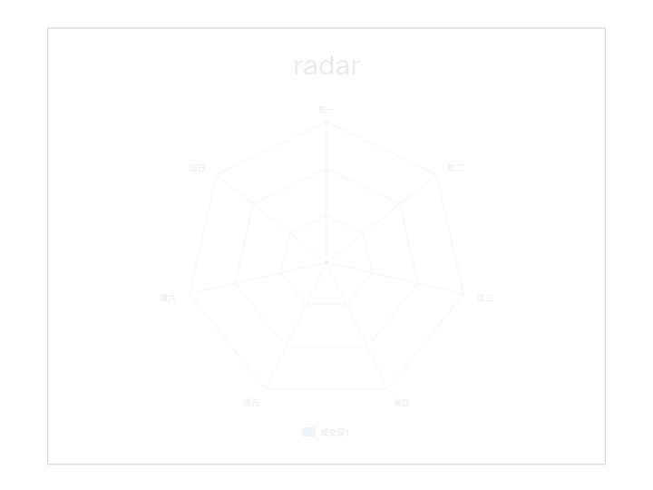
  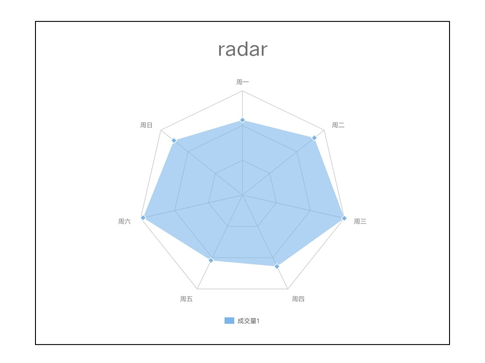
</div>

```html
<template>
  <div class="wrap">
    <div class="chart-wrap">
      <text class="title">radar</text>
      <canvas
        id="chartRadar"
        class="chart"
        style="width: {{width}}px; height: {{height}}px;"
      ></canvas>
    </div>
  </div>
</template>
<style lang="less">
  .wrap {
    flex-direction: column;
    align-items: center;
    .chart-wrap {
      flex-direction: column;
      border: 1px solid #000;
      padding: 20px;
      margin-bottom: 20px;
      .title {
        font-size: 30px;
        font-weight: bold;
        text-align: center;
        margin-bottom: 20px;
      }
    }
  }
</style>
<script>
  import Charts from "apex-ui/components/charts/index";

  let $chartRadar = "";

  export default {
    data() {
      return {
        width: 600,
        height: 400,
        backgroundColor: "#eee"
      };
    },
    async onShow() {
      await this.initChartRadar();
    },
    initChartRadar() {
      return new Promise((resolve, reject) => {
        $chartRadar = new Charts({
          element: this.$element("chartRadar"),
          type: "radar",
          width: this.width,
          height: this.height,
          backgroundColor: this.backgroundColor,
          animation: true,
          categories: ["周一", "周二", "周三", "周四", "周五", "周六", "周日"],
          series: [
            {
              name: "成交量1",
              data: [90, 110, 125, 95, 87, 122, 105]
            }
          ]
        });

        $chartRadar.addEventListener("renderComplete", () => {
          console.log("chartRadar renderComplete");
          resolve();
        });
      });
    }
  };
</script>
```
