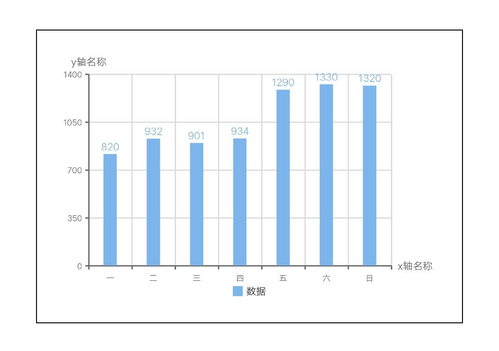
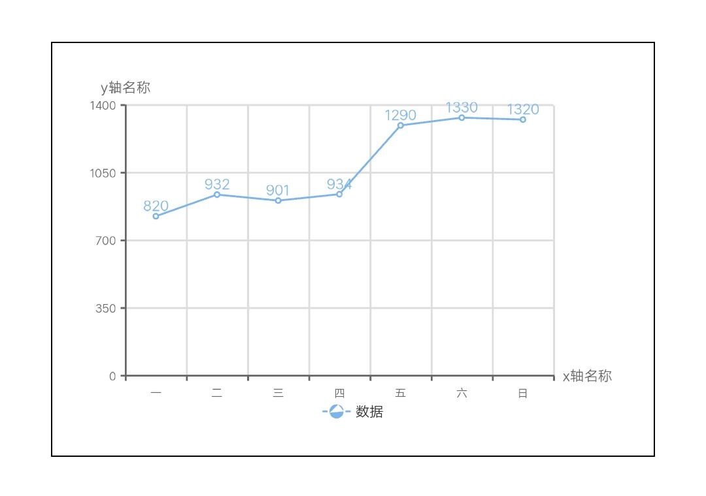
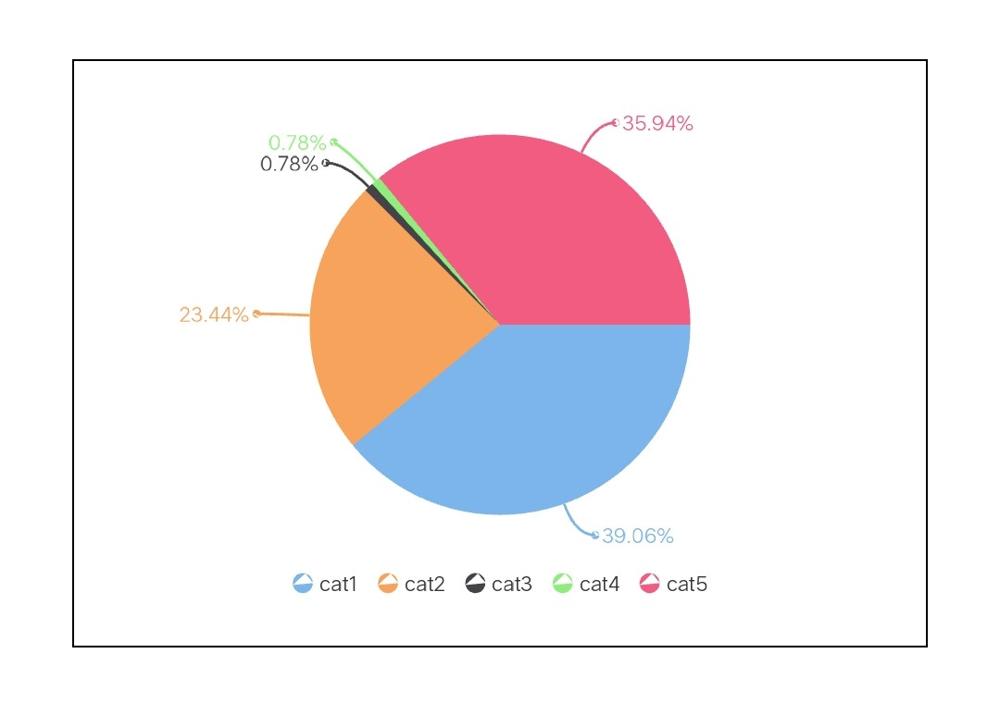
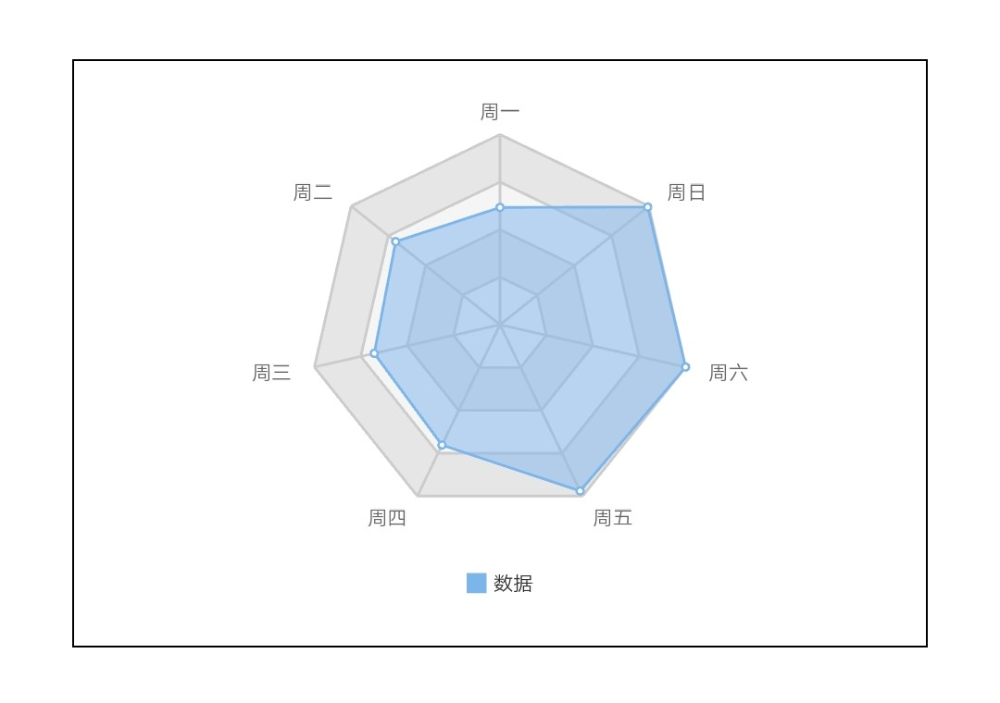

## 参数说明

### 描述

来源于 [wx-charts](https://github.com/xiaolin3303/wx-charts)，基于 canvas 绘制，体积小巧。

### 支持的图表类型

- 柱状图 bar
- 折线图 line
- 饼图 pie
- 雷达图 radar

### 使用效果

<div style="text-align: center;margin: 40px;">
  
  
  
  
</div>

### 使用方法

1. 在 script 中引入方法
2. 在 script 定义变量保存 Charts 实例，为避免堆栈溢出问题，请勿赋值给成员变量，参考 [快应用文档](https://doc.quickapp.cn/tutorial/framework/optimization-skills.html?h=%E5%A0%86%E6%A0%88%E6%BA%A2%E5%87%BA%E9%97%AE%E9%A2%98)
3. 定义图表绘制方法, 如果一个页面内存在多个图表会导致图表动画失效，可以使用 async, await 同步绘制各个图表，保证正常动画效果
4. 初始化图表方法只能在 onShow 生命周期调用

```html
<script>
  import Charts from "apex-ui/components/charts/qacharts-min.js";

  let $chart1 = "";
  let $chart2 = "";

  export default {
    async onShow() {
      await this.initChart1();
      await this.initChart2();
    },
    initChart1() {
      return new Promise((resolve, reject) => {
        $chart1 = new Charts({});

        $chart1.addEventListener("renderComplete", () => {
          console.log("chart1 renderComplete");
          resolve();
        });
      });
    },
    initChart2() {
      return new Promise((resolve, reject) => {
        $chart2 = new Charts({});

        $chart2.addEventListener("renderComplete", () => {
          console.log("chart2 renderComplete");
          resolve();
        });
      });
    }
  };
</script>
```

### 参数说明

| 属性                          | 类型    | 必填 | 默认值        | 说明                                                                                           |
| ----------------------------- | ------- | ---- | ------------- | ---------------------------------------------------------------------------------------------- |
| options                       | Object  | 必填 |               | 配置项                                                                                         |
| options.element               | Object  | 必填 |               | canvas 对象，快应用中用 this.\$element('id')获取                                               |
| options.type                  | String  | 必填 |               | 图表类型，可选值：bar，line，pie，radar                                                        |
| options.width                 | Number  | 必填 |               | 图表宽度                                                                                       |
| options.height                | Number  | 必填 |               | 图表高度                                                                                       |
| options.animation             | Boolean |      | true          | 图表动画是否开启                                                                               |
| options.animationDuration     | String  |      | 1000          | 图表动画时间                                                                                   |
| options.animationTiming       | String  |      | 'default'     | 图表动画速度曲线，可选值：default，easeIn，easeOut，easeInOut，linear                          |
| options.backgroundColor       | String  |      | '#ffffff'     | 背景颜色（如果页面背景颜色不是白色请设置为页面的背景颜色）                                     |
| options.colors                | Array   |      |               | 调色盘                                                                                         |
| options.padding               | Array   |      | [20,20,20,20] | padding 设置，最小值为 0                                                                       |
| options.label                 | Object  |      |               | 全局 label 配置，权重大于单项配置                                                              |
| label.show                    | Boolean |      | true          | 是否显示标签                                                                                   |
| label.fontSize                | Number  |      | 15            | 标签文字大小                                                                                   |
| label.color                   | String  |      | 'auto'        | 标签文字颜色                                                                                   |
| label.margin                  | Number  |      | 2             | 标签文字与图表的距离                                                                           |
| options.legend                | Object  |      |               | 图例配置                                                                                       |
| legend.show                   | Boolean |      | true          | 是否显示图例                                                                                   |
| legend.type                   | String  |      | 'default'     | 图例类型，可选值：default，circle，line，rect                                                  |
| legend.marginTop              | Number  |      | 8             | 图例与图表的距离                                                                               |
| legend.itemGap                | Number  |      | 15            | 图例间隙                                                                                       |
| legend.shapeWidth             | Number  |      | 15            | 图例图标宽度                                                                                   |
| legend.shapeHeight            | Number  |      | 15            | 图例图标高度                                                                                   |
| legend.textStyle              | Object  |      |               | 图例文字配置                                                                                   |
| textStyle.fontSize            | Number  |      | 15            | 图例文字大小                                                                                   |
| textStyle.color               | String  |      | '#333333'     | 图例文字颜色                                                                                   |
| textStyle.padding             | Number  |      | 2             | 图例文字与图标之间的距离                                                                       |
| options.radarAxis             | Object  |      |               | 雷达图轴线配置                                                                                 |
| radarAxis.shape               | String  |      | 'polygon'     | 雷达图形状，可选值：polygon，circle                                                            |
| radarAxis.center              | Array   |      | ['50%','50%'] | 雷达图中心位置                                                                                 |
| radarAxis.radius              | String  |      | '80%'         | 雷达图直径                                                                                     |
| radarAxis.max                 | Number  |      | 'auto'        | 雷达图最大值                                                                                   |
| radarAxis.splitNumber         | String  |      | 4             | 雷达图网格线分割数量                                                                           |
| radarAxis.axisLine            | Object  |      |               | 雷达图轴线配置                                                                                 |
| axisLine.show                 | Boolean |      | true          | 是否显示轴线                                                                                   |
| axisLine.lineStyle            | Object  |      |               | 雷达图轴线样式                                                                                 |
| axisLine.lineStyle.lineWidth  | Number  |      | 1             | 雷达图轴线线宽                                                                                 |
| axisLine.lineStyle.color      | String  |      | '#ccc'        | 雷达图轴线颜色                                                                                 |
| axisLine.lineStyle.opacity    | Number  |      | 1             | 雷达图轴线透明度                                                                               |
| radarAxis.splitLine           | Object  |      |               | 雷达图网格线配置                                                                               |
| splitLine.show                | Boolean |      | true          | 是否显示网格线                                                                                 |
| splitLine.lineStyle           | Object  |      |               | 雷达图网格线样式                                                                               |
| splitLine.lineStyle.lineWidth | Number  |      | 1             | 雷达图网格线线宽                                                                               |
| splitLine.lineStyle.color     | String  |      | '#ccc'        | 雷达图网格线颜色                                                                               |
| splitLine.lineStyle.opacity   | Number  |      | 1             | 雷达图网格线透明度                                                                             |
| radarAxis.splitArea           | Object  |      |               | 雷达图网格线区间配置                                                                           |
| splitLine.odd                 | Object  |      |               | 奇数区间配置                                                                                   |
| splitLine.odd.show            | Boolean |      | true          | 是否显示奇数区间                                                                               |
| splitLine.odd.color           | String  |      | '#f5f5f5'     | 奇数区间颜色                                                                                   |
| splitLine.odd.opacity         | Number  |      | 1             | 奇数区间透明度                                                                                 |
| splitLine.even                | Object  |      |               | 偶数区间配置                                                                                   |
| splitLine.even.show           | Boolean |      | true          | 是否显示偶数区间                                                                               |
| splitLine.even.color          | String  |      | '#e6e6e6'     | 偶数区间颜色                                                                                   |
| splitLine.even.opacity        | Number  |      | 1             | 偶数区间透明度                                                                                 |
| options.xAxis                 | Object  |      |               | x 轴配置                                                                                       |
| xAxis.show                    | Boolean |      | true          | 是否显示 x 轴                                                                                  |
| xAxis.boundaryGap             | Boolean |      | true          | boundaryGap 为 true 时, 这时候刻度只是作为分隔线，标签和数据点都会在两个刻度之间的带(band)中间 |
| xAxis.axisName                | Object  |      |               | x 轴名称配置                                                                                   |
| axisName.show                 | Boolean |      | true          | 是否显示 x 轴名称                                                                              |
| axisName.text                 | String  |      | 'x 轴名称'    | x 轴名称                                                                                       |
| axisName.gap                  | Number  |      | 10            | x 轴名字和轴线间的间隙                                                                         |
| axisName.textStyle            | Object  |      |               | x 轴名字字体配置                                                                               |
| textStyle.color               | String  |      | '#666'        | x 轴名字字体颜色                                                                               |
| textStyle.fontSize            | Number  |      | 15            | x 轴名字字体大小                                                                               |
| xAxis.axisLabel               | Object  |      |               | x 轴标签配置                                                                                   |
| axisLabel.show                | Boolean |      | true          | 是否显示 x 轴标签                                                                              |
| axisLabel.showIndex           | Array   |      |               | 控制显示的 x 轴标签的下标数组，仅限折线图                                                      |
| axisLabel.rotate              | Number  |      | 0             | x 轴标签旋转角度                                                                               |
| axisLabel.gap                 | Number  |      | 5             | 是否显示 x 轴标签                                                                              |
| axisLabel.textStyle           | Object  |      |               | x 轴标签字体配置                                                                               |
| textStyle.color               | String  |      | '#666'        | x 轴标签字体颜色                                                                               |
| textStyle.fontSize            | Number  |      | 12            | x 轴标签字体大小                                                                               |
| xAxis.axisTick                | Object  |      |               | x 轴刻度线配置                                                                                 |
| axisTick.show                 | Boolean |      | true          | 是否显示 x 轴刻度线                                                                            |
| axisTick.showIndex            | Array   |      |               | 控制显示的 x 轴刻度线的下标数组，仅限折线图                                                    |
| axisTick.alignWithLabel       | Boolean |      | false         | alignWithLabel 为 true 时，刻度线与标签对齐                                                    |
| axisTick.length               | Number  |      | 5             | 是否显示 x 轴刻度线                                                                            |
| axisTick.lineStyle            | Object  |      |               | x 轴刻度线线配置                                                                               |
| lineStyle.lineWidth           | String  |      | 1             | x 轴刻度线线宽                                                                                 |
| lineStyle.color               | Number  |      | '#666'        | x 轴刻度线颜色                                                                                 |
| xAxis.axisLine                | Object  |      |               | x 轴轴线配置                                                                                   |
| axisLine.show                 | Boolean |      | true          | 是否显示 x 轴轴线                                                                              |
| axisLine.showIndex            | Array   |      |               | 控制显示的 x 轴轴线的下标数组，仅限折线图                                                      |
| axisLine.lineStyle            | Object  |      |               | x 轴轴线线配置                                                                                 |
| lineStyle.lineWidth           | String  |      | 1             | x 轴轴线线宽                                                                                   |
| lineStyle.color               | Number  |      | '#666'        | x 轴轴线颜色                                                                                   |
| xAxis.axisSplitLine           | Object  |      |               | x 轴网格线配置                                                                                 |
| axisSplitLine.show            | Boolean |      | true          | 是否显示 x 轴网格线                                                                            |
| axisSplitLine.showIndex       | Array   |      |               | 控制显示的 x 轴网格线的下标数组，仅限折线图                                                    |
| axisSplitLine.lineStyle       | Object  |      |               | x 轴网格线线配置                                                                               |
| lineStyle.lineWidth           | String  |      | 1             | x 轴网格线线宽                                                                                 |
| lineStyle.color               | Number  |      | '#ddd'        | x 轴网格线颜色                                                                                 |
| options.yAxis                 | Object  |      |               | y 轴配置                                                                                       |
| yAxis.show                    | Boolean |      | true          | 是否显示 y 轴                                                                                  |
| yAxis.max                     | String  |      | 'auto'        | y 轴最大值                                                                                     |
| yAxis.min                     | String  |      | 'auto'        | y 轴最小值                                                                                     |
| yAxis.splitNumber             | Number  |      | 4             | y 轴显示段数                                                                                   |
| yAxis.axisName                | Object  |      |               | y 轴名称配置                                                                                   |
| axisName.show                 | Boolean |      | true          | 是否显示 x 轴名称                                                                              |
| axisName.text                 | String  |      | 'y 轴名称'    | y 轴名称                                                                                       |
| axisName.gap                  | Number  |      | 10            | y 轴名字和轴线间的间隙                                                                         |
| axisName.textStyle            | Object  |      |               | y 轴名字字体配置                                                                               |
| textStyle.color               | String  |      | '#666'        | y 轴名字字体颜色                                                                               |
| textStyle.fontSize            | Number  |      | 15            | y 轴名字字体大小                                                                               |
| textStyle.align               | String  |      | 'center'      | y 轴名字水平对齐方式                                                                           |
| yAxis.axisLabel               | Object  |      |               | y 轴标签配置                                                                                   |
| axisLabel.show                | Boolean |      | true          | 是否显示 y 轴标签                                                                              |
| axisLabel.gap                 | Number  |      | 5             | 是否显示 y 轴标签                                                                              |
| axisLabel.textStyle           | Object  |      |               | y 轴标签字体配置                                                                               |
| textStyle.color               | String  |      | '#666'        | y 轴标签字体颜色                                                                               |
| textStyle.fontSize            | Number  |      | 12            | y 轴标签字体大小                                                                               |
| yAxis.axisTick                | Object  |      |               | y 轴刻度线配置                                                                                 |
| axisTick.show                 | Boolean |      | true          | 是否显示 y 轴刻度线                                                                            |
| axisTick.length               | Number  |      | 5             | 是否显示 y 轴刻度线                                                                            |
| axisTick.lineStyle            | Object  |      |               | y 轴刻度线线配置                                                                               |
| lineStyle.lineWidth           | String  |      | 1             | y 轴刻度线线宽                                                                                 |
| lineStyle.color               | Number  |      | '#666'        | y 轴刻度线颜色                                                                                 |
| xAxis.axisLine                | Object  |      |               | y 轴轴线配置                                                                                   |
| axisLine.show                 | Boolean |      | true          | 是否显示 y 轴轴线                                                                              |
| axisLine.lineStyle            | Object  |      |               | y 轴轴线线配置                                                                                 |
| lineStyle.lineWidth           | String  |      | 1             | y 轴轴线线宽                                                                                   |
| lineStyle.color               | Number  |      | '#666'        | y 轴轴线颜色                                                                                   |
| yAxis.axisSplitLine           | Object  |      |               | y 轴网格线配置                                                                                 |
| axisSplitLine.show            | Boolean |      | true          | 是否显示 y 轴网格线                                                                            |
| axisSplitLine.lineStyle       | Object  |      |               | y 轴网格线线配置                                                                               |
| lineStyle.lineWidth           | String  |      | 1             | y 轴网格线线宽                                                                                 |
| lineStyle.color               | Number  |      | '#ddd'        | y 轴网格线颜色                                                                                 |
| options.categories            | Array   | 必填 |               | 数据类别                                                                                       |
| options.series                | Array   | 必填 |               | 数据列表                                                                                       |
| seriesItem.name               | String  | 必填 |               | 数据名称                                                                                       |
| seriesItem.data               | Array   | 必填 |               | 数据数组                                                                                       |

#### 柱状图 seriesItem

| 属性                   | 类型   | 必填 | 默认值 | 说明               |
| ---------------------- | ------ | ---- | ------ | ------------------ |
| seriesItem.barMaxWidth | Number |      | 20     | 柱状图柱体最大宽度 |
| seriesItem.barMinWidth | Number |      | 1      | 柱状图柱体最小宽度 |
| seriesItem.barWidth    | String |      | 'auto' | 柱状图柱体宽度     |
| seriesItem.barGap      | Number |      | 5      | 柱状图柱体间隙     |

#### 饼图 seriesItem

| 属性                        | 类型    | 必填 | 默认值        | 说明                   |
| --------------------------- | ------- | ---- | ------------- | ---------------------- |
| seriesItem.center           | Array   |      | ['50%','50%'] | 饼图中心位置           |
| seriesItem.radius           | Array   |      | [0,'80%']     | 饼图内外直径           |
| seriesItem.offsetAngle      | Number  |      | 0             | 饼图起始角度偏移度数   |
| seriesItem.disablePieStroke | Boolean |      | true          | 不绘制饼图各区块分割线 |
| seriesItem.labelLine        | Object  |      |               | 饼图引导线配置         |
| labelLine.lineDotRadius     | Number  |      | 3             | 饼图引导线点半径       |
| labelLine.lineWidth         | Number  |      | 1             | 饼图引导线线宽         |
| labelLine.length1           | Number  |      | 25            | 饼图引导线一段长度     |
| labelLine.length2           | Number  |      | 15            | 饼图引导线二段长度     |

#### 折线图 seriesItem

| 属性                    | 类型    | 必填 | 默认值   | 说明                                 |
| ----------------------- | ------- | ---- | -------- | ------------------------------------ |
| seriesItem.showIndex    | Array   |      |          | 控制显示的数据的下标数组，仅限折线图 |
| seriesItem.smooth       | Boolean |      | false    | 是否显示曲线                         |
| seriesItem.connectNulls | Boolean |      | false    | 数据为 NULL 时，是否跳过连接         |
| seriesItem.line         | Object  |      |          | 折线图线配置                         |
| line.show               | Boolean |      | true     | 是否显示折线图折线                   |
| line.lineWidth          | Number  |      | 2        | 折线图折线线宽                       |
| line.color              | Boolean |      | 'auto'   | 折线图折线颜色                       |
| line.opacity            | Number  |      | 1        | 折线图折线透明度                     |
| seriesItem.symbol       | Object  |      |          | 折线图标记点配置                     |
| symbol.show             | Boolean |      | true     | 是否显示折线图标记点                 |
| symbol.type             | String  |      | 'circle' | 折线图标记点类型，可选值：circle     |
| symbol.size             | Number  |      | 7        | 折线图标记点大小                     |
| symbol.color            | String  |      | 'auto'   | 折线图标记点颜色                     |
| seriesItem.area         | Object  |      |          | 折线图区域配置                       |
| area.show               | Boolean |      | false    | 是否显示折线图区域                   |
| area.color              | String  |      | 'auto'   | 折线图区域颜色                       |
| area.opacity            | Number  |      | 0.5      | 折线图区域颜色透明度                 |

#### 雷达图 seriesItem

| 属性              | 类型    | 必填 | 默认值   | 说明                             |
| ----------------- | ------- | ---- | -------- | -------------------------------- |
| seriesItem.line   | Object  |      |          | 雷达图数据线配置                 |
| line.show         | Boolean |      | true     | 是否显示雷达图数据线             |
| line.lineWidth    | Number  |      | 1        | 雷达图数据线线宽                 |
| line.color        | String  |      | 'auto'   | 雷达图数据线颜色                 |
| line.opacity      | Number  |      | 1        | 雷达图数据线颜色透明度           |
| seriesItem.symbol | Object  |      |          | 雷达图数据标记点配置             |
| symbol.show       | Boolean |      | true     | 是否显示雷达图标记点             |
| symbol.type       | String  |      | 'circle' | 雷达图标记点类型，可选值：circle |
| symbol.size       | Number  |      | 7        | 雷达图标记点大小                 |
| symbol.color      | String  |      | 'auto'   | 雷达图标记点颜色                 |
| seriesItem.area   | Object  |      |          | 雷达图区域配置                   |
| area.show         | Boolean |      | true     | 是否显示雷达图区域               |
| area.color        | String  |      | 'auto'   | 雷达图区域颜色                   |
| area.opacity      | Number  |      | 0.5      | 雷达图区域颜色透明度             |

### 方法

| 方法名称      | 方法描述                                           | 参数    |
| ------------- | -------------------------------------------------- | ------- |
| updateData    | 更新图表数据，重新绘制图表                         | options |
| stopAnimation | 停止当前正在进行的动画效果，直接展示渲染的最终结果 |         |

### 事件

| 事件名称       | 事件描述                                             | 返回值 |
| -------------- | ---------------------------------------------------- | ------ |
| renderComplete | 图表渲染完成（如果有动画效果，则动画效果完成时触发） |        |
