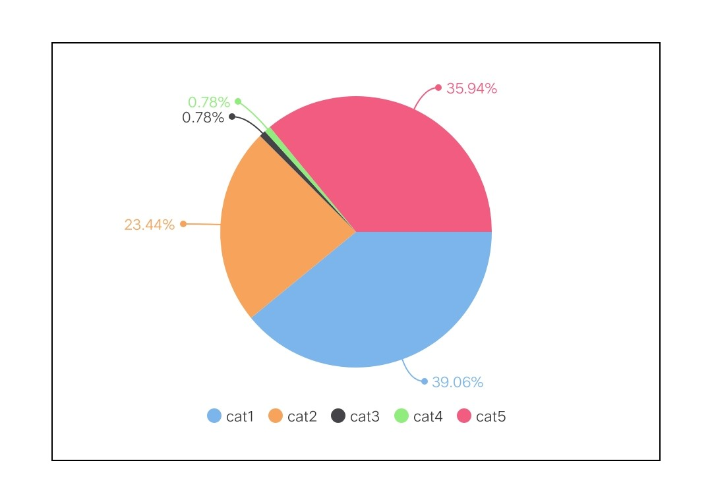
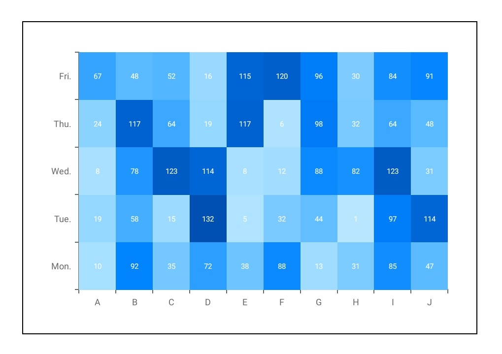
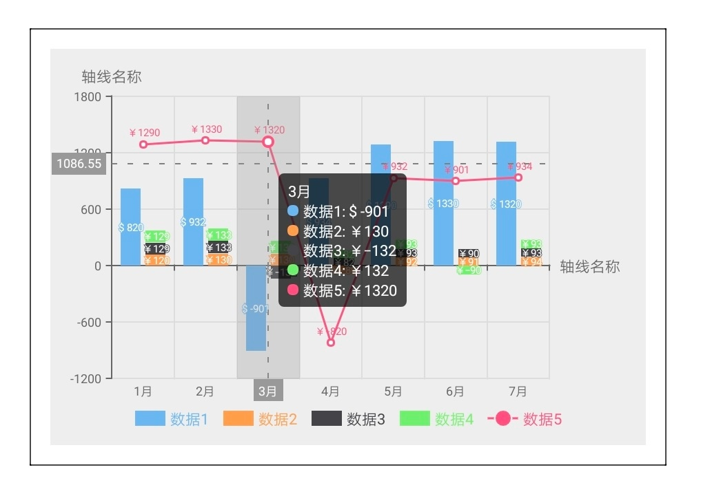
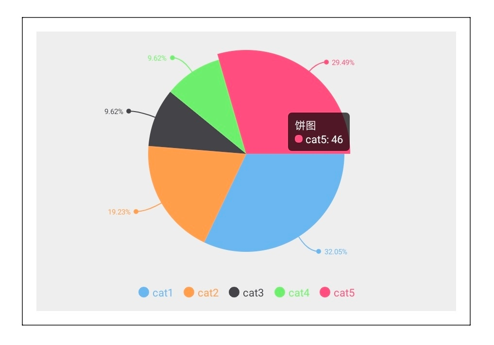
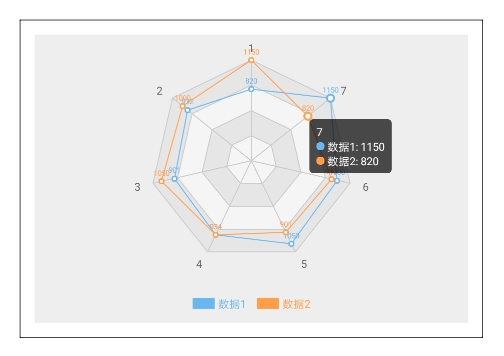

# 组件说明

## 描述

来源于 [wx-charts](https://github.com/xiaolin3303/wx-charts)，基于 canvas 绘制，体积小巧。

## 支持的图表类型

- 柱状图 bar
- 线图 line
- 饼图 pie
- 雷达图 radar
- 点图 scatter
- 漏斗图/金字塔图 funnel
- 蜡烛图/K线图 candlestick/k
- 热力图 heatmap
- 矩形树图 treemap  
- 词云图 tagCloud  

## 图表展示

<div style="text-align: center;margin: 40px;">
  
  
  
  
  
  
  
  
  
  
  
  
  
  
</div>

## tooltip展示
<div style="text-align: center;margin: 40px;">
  
  
  
  
  
</div>

## 使用方法

1. 在 script 中引入方法
2. 在 script 定义变量保存 Charts 实例，为避免堆栈溢出问题，请勿赋值给成员变量，参考 [快应用文档](https://doc.quickapp.cn/tutorial/framework/optimization-skills.html?h=%E5%A0%86%E6%A0%88%E6%BA%A2%E5%87%BA%E9%97%AE%E9%A2%98)
3. 定义图表绘制方法, 如果一个页面内存在多个图表会导致图表动画失效，可以使用 async, await 同步绘制各个图表，保证正常动画效果
4. 初始化图表方法只能在 onShow 生命周期调用

```html
<script>
  import Charts from "apex-ui/components/charts/qacharts-min.js";

  let $chart1, $chart2;

  export default {
    async onShow() {
      await this.initChart1();
      await this.initChart2();
    },
    initChart1() {
      return new Promise((resolve, reject) => {
        $chart1 = new Charts({
          ...
          ...
          ...
          onRenderComplete: () => {
            console.log('chart1 renderComplete')
            resolve()
          },
        })
      })
    },
    initChart2() {
      return new Promise((resolve, reject) => {
        $chart2 = new Charts({
          ...
          ...
          ...
          onRenderComplete: () => {
            console.log('chart2 renderComplete')
            resolve()
          },
        })
      })
    },
  };
</script>
```
