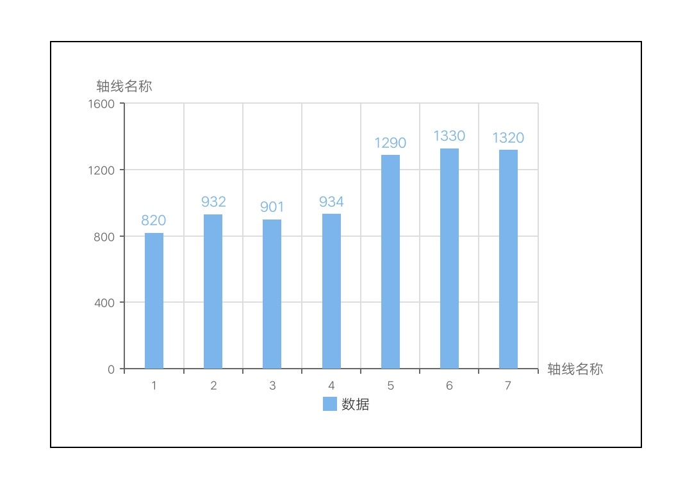
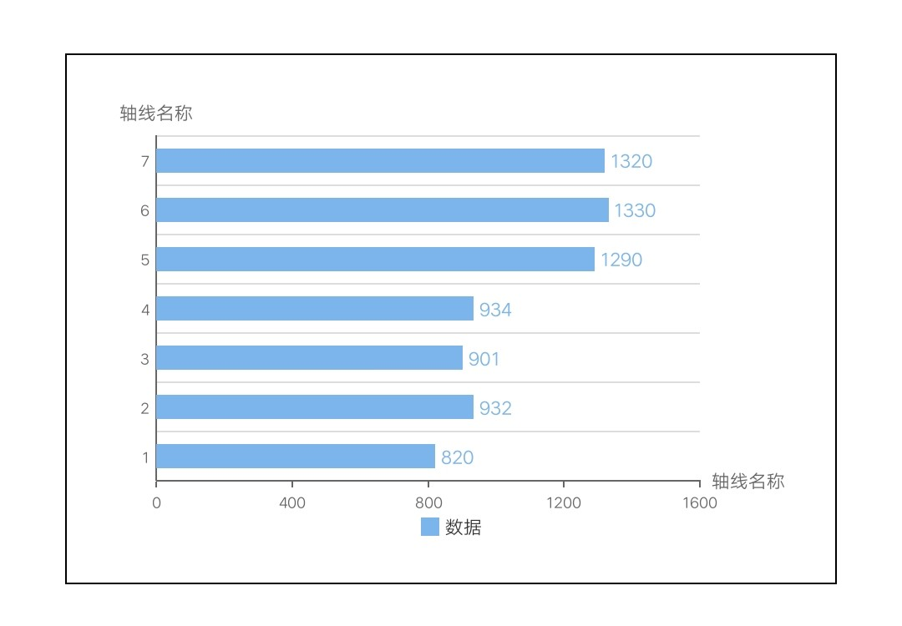

# 柱状图 bar

## 基础柱状图

<div style="text-align: center; margin: 40px;">
  
</div>

### 示例代码

```html
<template>
  <div class="chart-wrap">
    <canvas id="chart" style="width: {{width}}px; height: {{height}}px;"></canvas>
  </div>
</template>

<script>
  // import Charts from 'apex/components/charts/qacharts.js'
  import Charts from 'apex/components/charts/qacharts-min.js'

  let $chart

  export default {
    props: {
      width: {
        default: 600,
      },
      height: {
        default: 400,
      },
    },
    data() {
      return {}
    },
    initChart() {
      return new Promise((resolve, reject) => {
        $chart = new Charts({
          element: this.$element('chart'),
          type: 'bar',
          width: this.width,
          height: this.height,
          xAxis: {
            type: 'category',
            data: ['1', '2', '3', '4', '5', '6', '7'],
          },
          series: [
            {
              name: '数据',
              data: [820, 932, 901, 934, 1290, 1330, 1320],
            },
          ],
          onRenderComplete: () => {
            console.log('chartBar renderComplete')
            resolve()
          },
        })
      })
    },
  }
</script>
```

## 条形图

<div style="text-align: center; margin: 40px;">
  
</div>

### 示例代码

```html
<template>
  <div class="chart-wrap">
    <canvas id="chart" style="width: {{width}}px; height: {{height}}px;"></canvas>
  </div>
</template>

<script>
  // import Charts from 'apex/components/charts/qacharts.js'
  import Charts from 'apex/components/charts/qacharts-min.js'

  let $chart

  export default {
    props: {
      width: {
        default: 600,
      },
      height: {
        default: 400,
      },
    },
    data() {
      return {}
    },
    initChart() {
      return new Promise((resolve, reject) => {
        $chart = new Charts({
          element: this.$element('chart'),
          type: 'bar',
          width: this.width,
          height: this.height,
          yAxis: {
            type: 'category',
            data: ['1', '2', '3', '4', '5', '6', '7'],
          },
          xAxis: {
            type: 'value',
          },
          series: [
            {
              name: '数据',
              data: [820, 932, 901, 934, 1290, 1330, 1320],
            },
          ],
          onRenderComplete: () => {
            console.log('chartBar renderComplete')
            resolve()
          },
        })
      })
    },
  }
</script>
```

## 层叠柱状图

<div style="text-align: center; margin: 40px;">
  
</div>

### 示例代码

```html
<template>
  <div class="chart-wrap">
    <canvas id="chart" style="width: {{width}}px; height: {{height}}px;"></canvas>
  </div>
</template>

<script>
  // import Charts from 'apex/components/charts/qacharts.js'
  import Charts from 'apex/components/charts/qacharts-min.js'

  let $chart

  export default {
    props: {
      width: {
        default: 600,
      },
      height: {
        default: 400,
      },
    },
    data() {
      return {}
    },
    initChart() {
      return new Promise((resolve, reject) => {
        $chart = new Charts({
          element: this.$element('chart'),
          type: 'bar',
          width: this.width,
          height: this.height,
          yAxis: {
            type: 'category',
            data: ['1', '2', '3', '4', '5', '6', '7'],
          },
          xAxis: {
            type: 'value',
          },
          series: [
            {
              name: '数据1',
              data: [820, 932, 901, 934, 1290, 1330, 1320],
            },
            {
              name: '数据2',
              stack: '层叠数据',
              data: [82, 93, 90, 93, 129, 133, 132],
            },
            {
              name: '数据3',
              stack: '层叠数据',
              data: [82, 93, 90, 93, 129, 133, 132],
            },
            {
              name: '数据4',
              stack: '层叠数据',
              data: [82, 93, 90, 93, 129, 133, 132],
            },
          ],
          onRenderComplete: () => {
            console.log('chartBar renderComplete')
            resolve()
          },
        })
      })
    },
  }
</script>
```
