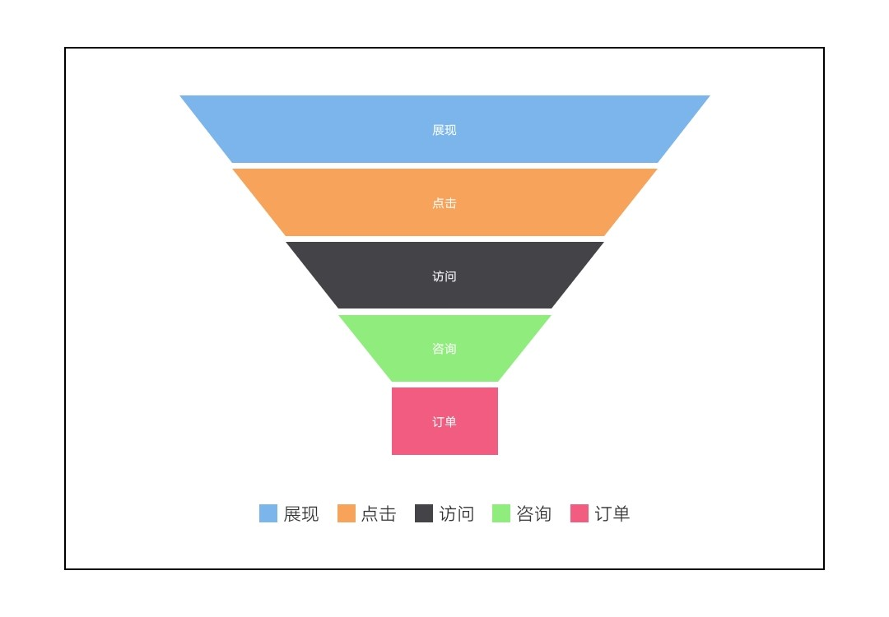
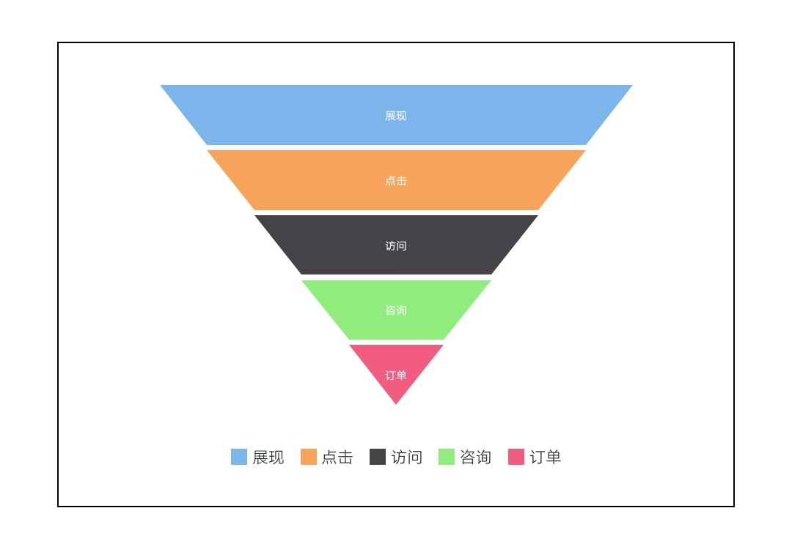

# 漏斗图 funnel

## 漏斗图

<div style="text-align: center; margin: 40px;">
  
</div>

### 示例代码

```html
<template>
  <div class="chart-wrap">
    <canvas id="chart" style="width: {{width}}px; height: {{height}}px;"></canvas>
  </div>
</template>

<script>
  import Charts from 'apex-ui/components/charts/qacharts-min.js'

  let $chart

  export default {
    props: {
      width: {
        default: 600,
      },
      height: {
        default: 400,
      },
    },
    data() {
      return {}
    },
    initChart() {
      $chart = new Charts({
        element: this.$element('chart'),
        width: this.width,
        height: this.height,
        series: [
          {
            name: '数据',
            type: 'funnel',
            left: '10%',
            right: '10%',
            bottom: '10%',
            data: [
              { value: 60, name: '访问' },
              { value: 40, name: '咨询' },
              { value: 20, name: '订单' },
              { value: 80, name: '点击' },
              { value: 100, name: '展现' },
            ],
          },
        ],
        onRenderComplete: () => {
          console.log('chartLine renderComplete')
        },
      })
    },
  }
</script>
```

## 金字塔图

<div style="text-align: center; margin: 40px;">
  
</div>

### 示例代码

```html
<template>
  <div class="chart-wrap">
    <canvas id="chart" style="width: {{width}}px; height: {{height}}px;"></canvas>
  </div>
</template>

<script>
  import Charts from 'apex-ui/components/charts/qacharts-min.js'

  let $chart

  export default {
    props: {
      width: {
        default: 600,
      },
      height: {
        default: 400,
      },
    },
    data() {
      return {}
    },
    initChart() {
      $chart = new Charts({
        element: this.$element('chart'),
        width: this.width,
        height: this.height,
        series: [
          {
            name: '数据',
            type: 'funnel',
            left: '10%',
            right: '10%',
            bottom: '10%',
            shape: 'pyramid',
            data: [
              { value: 60, name: '访问' },
              { value: 40, name: '咨询' },
              { value: 20, name: '订单' },
              { value: 80, name: '点击' },
              { value: 100, name: '展现' },
            ],
          },
        ],
        onRenderComplete: () => {
          console.log('chartLine renderComplete')
        },
      })
    },
  }
</script>
```