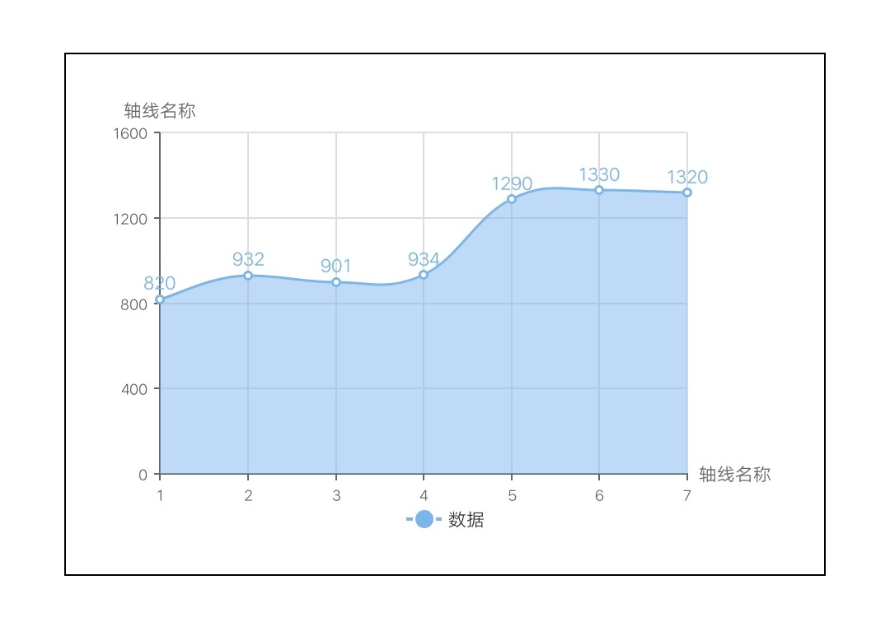
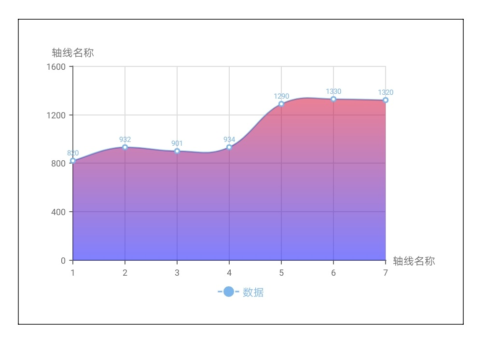

# 线图 line

## 基础折线图

<div style="text-align: center; margin: 40px;">
  
</div>

### 示例代码

```html
<template>
  <div class="chart-wrap">
    <canvas id="chart" style="width: {{width}}px; height: {{height}}px;"></canvas>
  </div>
</template>

<script>
  import Charts from 'apex-ui/components/charts/qacharts-min.js'

  let $chart

  export default {
    props: {
      width: {
        default: 600,
      },
      height: {
        default: 400,
      },
    },
    data() {
      return {}
    },
    initChart() {
      $chart = new Charts({
        element: this.$element('chart'),
        width: this.width,
        height: this.height,
        legend: {
          shapeWidth: 30,
          shapeHeight: 15,
        },
        xAxis: {
          type: 'category',
          data: ['1', '2', '3', '4', '5', '6', '7'],
        },
        series: [
          {
            name: '数据',
            type: 'line',
            data: [820, 932, 901, 934, 1290, 1330, 1320],
          },
        ],
        onRenderComplete: () => {
          console.log('chartLine renderComplete')
          resolve()
        },
      })
    },
  }
</script>
```

## 曲线图

<div style="text-align: center; margin: 40px;">
  
</div>

### 示例代码

```html
<template>
  <div class="chart-wrap">
    <canvas id="chart" style="width: {{width}}px; height: {{height}}px;"></canvas>
  </div>
</template>

<script>
  import Charts from 'apex-ui/components/charts/qacharts-min.js'

  let $chart

  export default {
    props: {
      width: {
        default: 600,
      },
      height: {
        default: 400,
      },
    },
    data() {
      return {}
    },
    initChart() {
      $chart = new Charts({
        element: this.$element('chart'),
        width: this.width,
        height: this.height,
        legend: {
          shapeWidth: 30,
          shapeHeight: 15,
        },
        xAxis: {
          type: 'category',
          boundaryGap: false,
          data: ['1', '2', '3', '4', '5', '6', '7'],
        },
        series: [
          {
            name: '数据',
            type: 'line',
            data: [820, 932, 901, 934, 1290, 1330, 1320],
            smooth: true,
          },
        ],
        onRenderComplete: () => {
          console.log('chartLine renderComplete')
          resolve()
        },
      })
    },
  }
</script>
```

## 面积图

<div style="text-align: center; margin: 40px;">
  
</div>

### 示例代码

```html
<template>
  <div class="chart-wrap">
    <canvas id="chart" style="width: {{width}}px; height: {{height}}px;"></canvas>
  </div>
</template>

<script>
  import Charts from 'apex-ui/components/charts/qacharts-min.js'

  let $chart

  export default {
    props: {
      width: {
        default: 600,
      },
      height: {
        default: 400,
      },
    },
    data() {
      return {}
    },
    initChart() {
      $chart = new Charts({
        element: this.$element('chart'),
        width: this.width,
        height: this.height,
        legend: {
          shapeWidth: 30,
          shapeHeight: 15,
        },
        xAxis: {
          type: 'category',
          data: ['1', '2', '3', '4', '5', '6', '7'],
        },
        series: [
          {
            name: '数据',
            type: 'line',
            data: [820, 932, 901, 934, 1290, 1330, 1320],
            area: {
              show: true,
            },
          },
        ],
        onRenderComplete: () => {
          console.log('chartLine renderComplete')
          resolve()
        },
      })
    },
  }
</script>
```

<div style="text-align: center; margin: 40px;">
  
</div>

### 示例代码

```html
<template>
  <div class="chart-wrap">
    <canvas id="chart" style="width: {{width}}px; height: {{height}}px;"></canvas>
  </div>
</template>

<script>
  import Charts from 'apex-ui/components/charts/qacharts-min.js'

  let $chart

  export default {
    props: {
      width: {
        default: 600,
      },
      height: {
        default: 400,
      },
    },
    data() {
      return {}
    },
    initChart() {
      $chart = new Charts({
        element: this.$element('chart'),
        width: this.width,
        height: this.height,
        legend: {
          shapeWidth: 30,
          shapeHeight: 15,
        },
        xAxis: {
          type: 'category',
          data: ['1', '2', '3', '4', '5', '6', '7'],
        },
        series: [
          {
            name: '数据',
            type: 'line',
            data: [820, 932, 901, 934, 1290, 1330, 1320],
            area: {
              show: true,
              color: {
                linearGradient: [0, 0, 0, 1],
                colors: [
                  { offset: 0, color: 'red' },
                  { offset: 1, color: 'blue' },
                ],
              },
            },
          },
        ],
        onRenderComplete: () => {
          console.log('chartLine renderComplete')
          resolve()
        },
      })
    },
  }
</script>
```

## 存在空值

<div style="text-align: center; margin: 40px;">
  
  
</div>

### 示例代码

```html
<template>
  <div class="chart-wrap">
    <canvas id="chart" style="width: {{width}}px; height: {{height}}px;"></canvas>
  </div>
</template>

<script>
  import Charts from 'apex-ui/components/charts/qacharts-min.js'

  let $chart

  export default {
    props: {
      width: {
        default: 600,
      },
      height: {
        default: 400,
      },
    },
    data() {
      return {}
    },
    initChart() {
        $chart = new Charts({
          element: this.$element('chart'),
          width: this.width,
          height: this.height,
          legend: {
            shapeWidth: 30,
            shapeHeight: 15,
          },
          xAxis: {
            type: 'category',
            data: ['1', '2', '3', '4', '5', '6', '7'],
          },
          series: [
            {
              name: '数据',
              type: 'line',
              connectNulls: true,
              data: [820, 932, null, 934, 1290, 1330, 1320],
            },
          ],
          onRenderComplete: () => {
            console.log('chartLine renderComplete')
            resolve()
          },
        })
    },
  }
</script>
```
