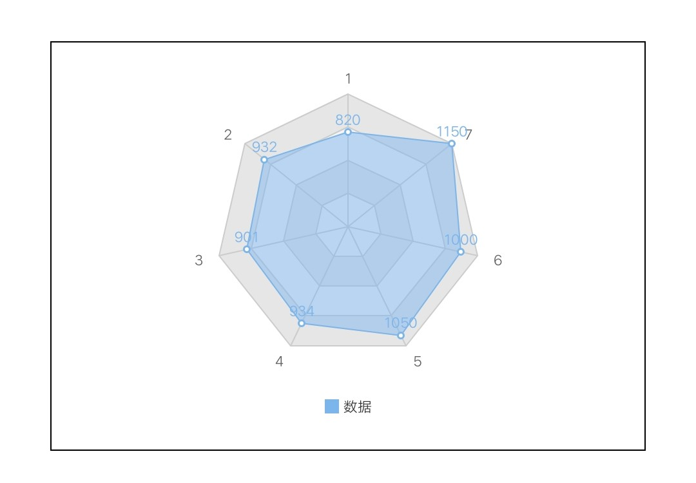

# 雷达图 Radar

## 基础雷达图

<div style="text-align: center; margin: 40px;">
  
</div>

### 示例代码

```html
<template>
  <div class="chart-wrap">
    <canvas id="chart" style="width: {{width}}px; height: {{height}}px;"></canvas>
  </div>
</template>

<script>
  import Charts from "apex-ui/components/charts/qacharts-min.js";

  let $chart;

  export default {
    props: {
      width: {
        default: 600,
      },
      height: {
        default: 400,
      },
    },
    data() {
      return {};
    },
    initChart() {
      $chart = new Charts({
        element: this.$element("chart"),
        width: this.width,
        height: this.height,
        category: [1,2,3,4,5,6,7]
        series: [
          {
            name: "数据",
            type: "radar",
            data: [820, 932, 901, 934, 1290, 1330, 1320]
          }
        ],
        onRenderComplete: () => {
          console.log("chartRadar renderComplete");
        }
      });
    }
  };
</script>
```

## 圆形面积图

<div style="text-align: center; margin: 40px;">
  
</div>

### 示例代码

```html
<template>
  <div class="chart-wrap">
    <canvas id="chart" style="width: {{width}}px; height: {{height}}px;"></canvas>
  </div>
</template>

<script>
  import Charts from "apex-ui/components/charts/qacharts-min.js";

  let $chart;

  export default {
    props: {
      width: {
        default: 600,
      },
      height: {
        default: 400,
      },
    },
    data() {
      return {};
    },
    initChart() {
      $chart = new Charts({
        element: this.$element("chart"),
        width: this.width,
        height: this.height,
        radarAxis: {
          shape: 'circle'
        },
        category: [1,2,3,4,5,6,7]
        series: [
          {
            name: "数据",
            type: "radar",
            data: [820, 932, 901, 934, 1290, 1330, 1320],
            area: {
              show: true
            }
          }
        ],
        onRenderComplete: () => {
          console.log("chartRadar renderComplete");
        }
      });
    }
  };
</script>
```

## 雷达面积图

<div style="text-align: center; margin: 40px;">
  
</div>

### 示例代码

```html
<template>
  <div class="chart-wrap">
    <canvas id="chart" style="width: {{width}}px; height: {{height}}px;"></canvas>
  </div>
</template>

<script>
  import Charts from "apex-ui/components/charts/qacharts-min.js";

  let $chart;

  export default {
    props: {
      width: {
        default: 600,
      },
      height: {
        default: 400,
      },
    },
    data() {
      return {};
    },
    initChart() {
      $chart = new Charts({
        element: this.$element("chart"),
        width: this.width,
        height: this.height,
        category: [1,2,3,4,5,6,7]
        series: [
          {
            name: "数据",
            type: "radar",
            data: [820, 932, 901, 934, 1290, 1330, 1320],
            area: {
              show: true
            }
          }
        ],
        onRenderComplete: () => {
          console.log("chartRadar renderComplete");
        }
      });
    }
  };
</script>
```
