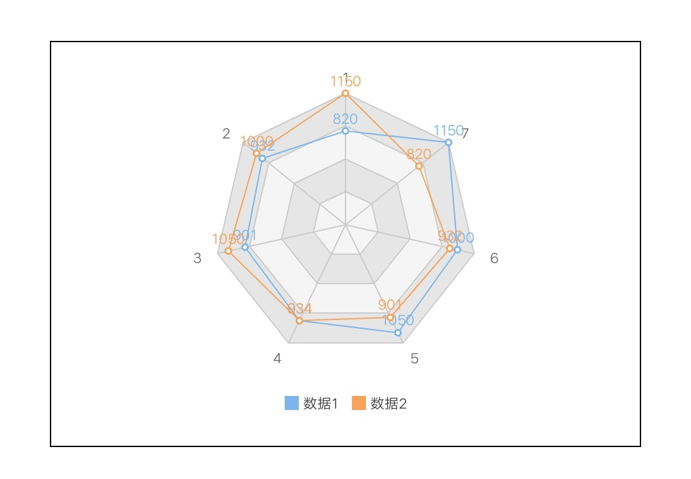
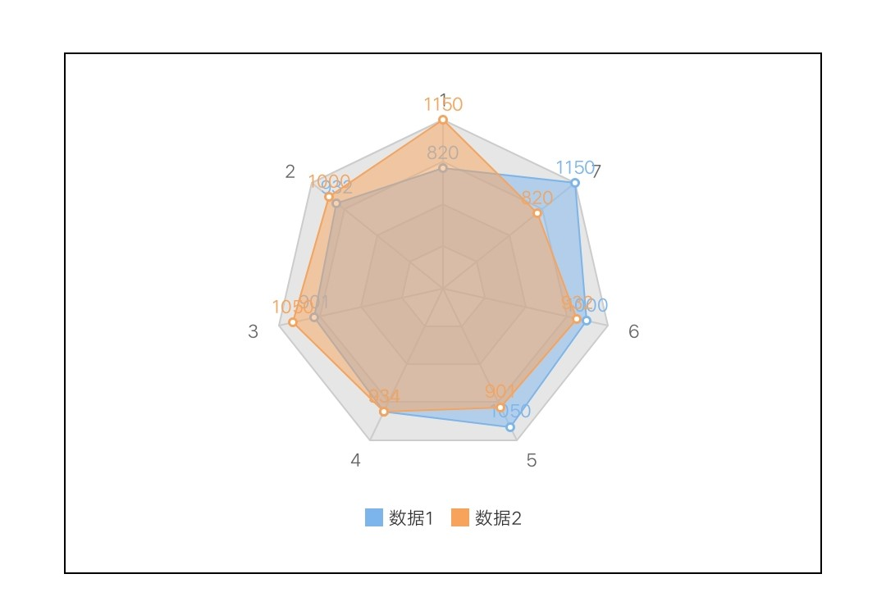

# 雷达图 Radar

## 基础雷达图

<div style="text-align: center; margin: 40px;">
  
  
</div>

### 示例代码

```html
<template>
  <div class="chart-wrap">
    <canvas id="chart" style="width: {{width}}px; height: {{height}}px;"></canvas>
  </div>
</template>

<script>
  // import Charts from 'apex/components/charts/qacharts.js'
  import Charts from "apex/components/charts/qacharts-min.js";

  let $chart;

  export default {
    data() {
      return {};
    },
    initChart() {
      return new Promise((resolve, reject) => {
        $chart = new Charts({
          element: this.$element("chart"),
          type: "radar",
          width: 600,
          height: 400,
          category: [1,2,3,4,5,6,7]
          series: [
            {
              name: "数据",
              data: [820, 932, 901, 934, 1290, 1330, 1320]
            }
          ],
          onRenderComplete: () => {
            console.log("chartRadar renderComplete");
            resolve();
          }
        });
      });
    }
  };
</script>
```

## 圆形面积图

<div style="text-align: center; margin: 40px;">
  
</div>

### 示例代码

```html
<template>
  <div class="chart-wrap">
    <canvas id="chart" style="width: {{width}}px; height: {{height}}px;"></canvas>
  </div>
</template>

<script>
  // import Charts from 'apex/components/charts/qacharts.js'
  import Charts from "apex/components/charts/qacharts-min.js";

  let $chart;

  export default {
    data() {
      return {};
    },
    initChart() {
      return new Promise((resolve, reject) => {
        $chart = new Charts({
          element: this.$element("chart"),
          type: "radar",
          width: 600,
          height: 400,
          radarAxis: {
            shape: 'circle'
          },
          category: [1,2,3,4,5,6,7]
          series: [
            {
              name: "数据",
              data: [820, 932, 901, 934, 1290, 1330, 1320],
              area: {
                show: true
              }
            }
          ],
          onRenderComplete: () => {
            console.log("chartRadar renderComplete");
            resolve();
          }
        });
      });
    }
  };
</script>
```

## 雷达面积图

<div style="text-align: center; margin: 40px;">
  
  
</div>

### 示例代码

```html
<template>
  <div class="chart-wrap">
    <canvas id="chart" style="width: {{width}}px; height: {{height}}px;"></canvas>
  </div>
</template>

<script>
  // import Charts from 'apex/components/charts/qacharts.js'
  import Charts from "apex/components/charts/qacharts-min.js";

  let $chart;

  export default {
    data() {
      return {};
    },
    initChart() {
      return new Promise((resolve, reject) => {
        $chart = new Charts({
          element: this.$element("chart"),
          type: "radar",
          width: 600,
          height: 400,
          category: [1,2,3,4,5,6,7]
          series: [
            {
              name: "数据",
              data: [820, 932, 901, 934, 1290, 1330, 1320],
              area: {
                show: true
              }
            }
          ],
          onRenderComplete: () => {
            console.log("chartRadar renderComplete");
            resolve();
          }
        });
      });
    }
  };
</script>
```
