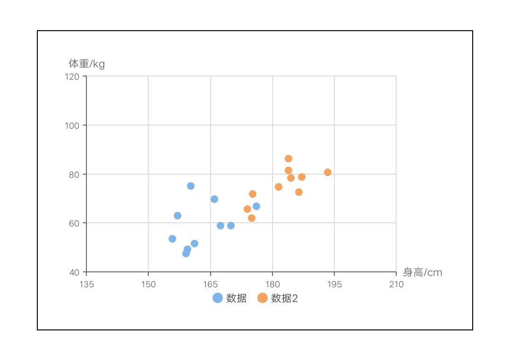

# 点图 scatter

## 散点图

<div style="text-align: center; margin: 40px;">
  
  
</div>

### 示例代码

```html
<template>
  <div class="chart-wrap">
    <canvas id="chart" style="width: {{width}}px; height: {{height}}px;"></canvas>
  </div>
</template>

<script>
  // import Charts from 'apex/components/charts/qacharts.js'
  import Charts from 'apex/components/charts/qacharts-min.js'

  let $chart

  export default {
    data() {
      return {}
    },
    initChart() {
      return new Promise((resolve, reject) => {
        $chart = new Charts({
          element: this.$element('chart'),
          type: 'line',
          width: 600,
          height: 400,
          yAxis: {
            type: 'value',
            max: 120,
            min: 40,
            splitNumber: 4,
            axisName: {
              text: '体重/kg',
            },
          },
          xAxis: {
            type: 'value',
            max: 210,
            min: 135,
            splitNumber: 5,
            axisName: {
              text: '身高/cm',
            },
          },
          series: [
            {
              name: '数据',
              radius: 5,
              data: [
                {
                  x: 161.2,
                  y: 51.6,
                },
                {
                  x: 167.5,
                  y: 59,
                },
                {
                  x: 159.5,
                  y: 49.2,
                },
                {
                  x: 157,
                  y: 63,
                },
                {
                  x: 155.8,
                  y: 53.6,
                },
                {
                  x: 170,
                  y: 59,
                },
                {
                  x: 159.1,
                  y: 47.6,
                },
                {
                  x: 166,
                  y: 69.8,
                },
                {
                  x: 176.2,
                  y: 66.8,
                },
                {
                  x: 160.2,
                  y: 75.2,
                },
              ],
            },
          ],
          onRenderComplete: () => {
            console.log('chartLine renderComplete')
            resolve()
          },
        })
      })
    },
  }
</script>
```
