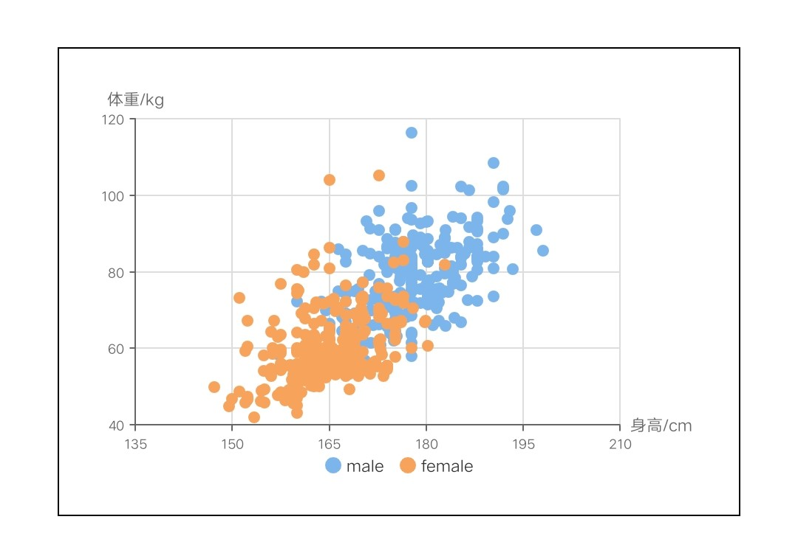
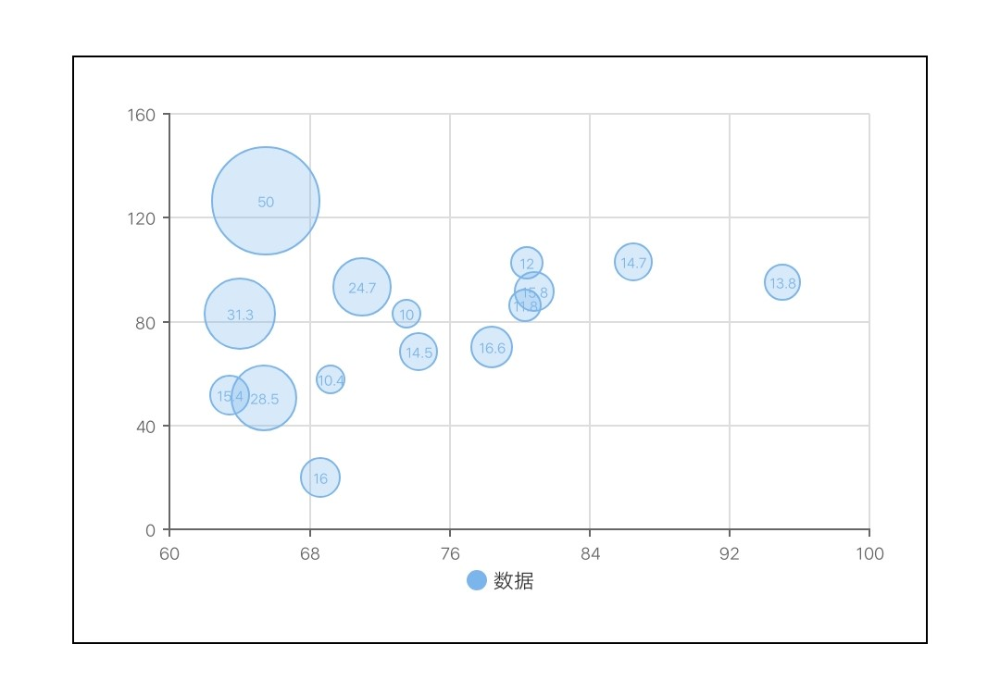
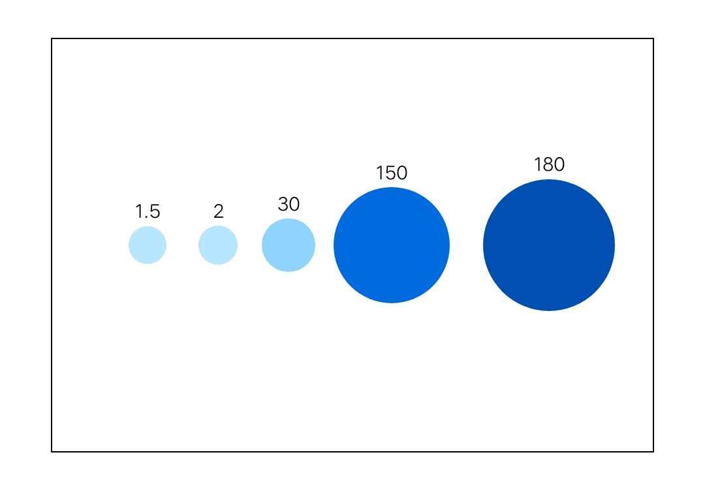

# 点图 scatter

## 散点图

<div style="text-align: center; margin: 40px;">
  
  
</div>

### 示例代码

```html
<template>
  <div class="chart-wrap">
    <canvas id="chart" style="width: {{width}}px; height: {{height}}px;"></canvas>
  </div>
</template>

<script>
  import Charts from 'apex-ui/components/charts/qacharts-min.js'

  let $chart

  export default {
    props: {
      width: {
        default: 600,
      },
      height: {
        default: 400,
      },
    },
    data() {
      return {}
    },
    initChart() {
      $chart = new Charts({
        element: this.$element('chart'),
        width: this.width,
        height: this.height,
        yAxis: {
          type: 'value',
          max: 120,
          min: 40,
          splitNumber: 4,
          axisName: {
            text: '体重/kg',
          },
        },
        xAxis: {
          type: 'value',
          max: 210,
          min: 135,
          splitNumber: 5,
          axisName: {
            text: '身高/cm',
          },
        },
        series: [
          {
            name: '数据',
            type: "scatter",
            radius: 5,
            data: [
              {
                x: 161.2,
                y: 51.6,
              },
              {
                x: 167.5,
                y: 59,
              },
              {
                x: 159.5,
                y: 49.2,
              },
              {
                x: 157,
                y: 63,
              },
              {
                x: 155.8,
                y: 53.6,
              },
              {
                x: 170,
                y: 59,
              },
              {
                x: 159.1,
                y: 47.6,
              },
              {
                x: 166,
                y: 69.8,
              },
              {
                x: 176.2,
                y: 66.8,
              },
              {
                x: 160.2,
                y: 75.2,
              },
            ],
          },
        ],
        onRenderComplete: () => {
          console.log('chartLine renderComplete')
          resolve()
        },
      })
    },
  }
</script>
```

## 气泡图

<div style="text-align: center; margin: 40px;">
  
</div>

### 示例代码

```html
<template>
  <div class="chart-wrap">
    <canvas id="chart" style="width: {{width}}px; height: {{height}}px;"></canvas>
  </div>
</template>

<script>
  import Charts from 'apex-ui/components/charts/qacharts-min.js'

  let $chart

  export default {
    props: {
      width: {
        default: 600,
      },
      height: {
        default: 400,
      },
    },
    data() {
      return {}
    },
    initChart() {
      $chart = new Charts({
        element: this.$element('chart'),
        width: this.width,
        height: this.height,
        yAxis: {
          type: 'value',
          splitNumber: 4,
          axisName: {
            show: false,
          },
        },
        xAxis: {
          type: 'value',
          max: 100,
          min: 60,
          splitNumber: 5,
          axisName: {
            show: false,
          },
        },
        series: [
          {
            name: '数据',
            type: "scatter",
            radius: 5,
            data: [
              {
                x: 95,
                y: 95,
                z: 13.8,
                name: 'BE',
                country: 'Belgium',
              },
              {
                x: 86.5,
                y: 102.9,
                z: 14.7,
                name: 'DE',
                country: 'Germany',
              },
              {
                x: 80.8,
                y: 91.5,
                z: 15.8,
                name: 'FI',
                country: 'Finland',
              },
              {
                x: 80.4,
                y: 102.5,
                z: 12,
                name: 'NL',
                country: 'Netherlands',
              },
              {
                x: 80.3,
                y: 86.1,
                z: 11.8,
                name: 'SE',
                country: 'Sweden',
              },
              {
                x: 78.4,
                y: 70.1,
                z: 16.6,
                name: 'ES',
                country: 'Spain',
              },
              {
                x: 74.2,
                y: 68.5,
                z: 14.5,
                name: 'FR',
                country: 'France',
              },
              {
                x: 73.5,
                y: 83.1,
                z: 10,
                name: 'NO',
                country: 'Norway',
              },
              {
                x: 71,
                y: 93.2,
                z: 24.7,
                name: 'UK',
                country: 'United Kingdom',
              },
              {
                x: 69.2,
                y: 57.6,
                z: 10.4,
                name: 'IT',
                country: 'Italy',
              },
              {
                x: 68.6,
                y: 20,
                z: 16,
                name: 'RU',
                country: 'Russia',
              },
              {
                x: 65.5,
                y: 126.4,
                z: 50,
                name: 'US',
                country: 'United States',
              },
              {
                x: 65.4,
                y: 50.8,
                z: 28.5,
                name: 'HU',
                country: 'Hungary',
              },
              {
                x: 63.4,
                y: 51.8,
                z: 15.4,
                name: 'PT',
                country: 'Portugal',
              },
              {
                x: 64,
                y: 82.9,
                z: 31.3,
                name: 'NZ',
                country: 'New Zealand',
              },
            ],
            radius: [10, 40],
            lineWidth: 1,
            opacity: 0.3,
          },
        ],
        onRenderComplete: () => {
          console.log('chartLine renderComplete')
          resolve()
        },
      })
    },
  }
</script>
```

## 使用量对比图

<div style="text-align: center; margin: 40px;">
  
</div>

### 示例代码

```html
<template>
  <div class="chart-wrap">
    <canvas id="chart" style="width: {{width}}px; height: {{height}}px;"></canvas>
  </div>
</template>

<script>
  import Charts from 'apex-ui/components/charts/qacharts-min.js'

  let $chart

  export default {
    props: {
      width: {
        default: 600,
      },
      height: {
        default: 400,
      },
    },
    data() {
      return {}
    },
    initChart() {
      $chart = new Charts({
        element: this.$element('chart'),
        width: this.width,
        height: this.height,
        legend: {
          show: false,
        },
        yAxis: {
          show: false,
          type: 'value',
          max: 100,
          min: 0,
          splitNumber: 5,
          axisName: {
            show: false,
          },
        },
        xAxis: {
          show: false,
          type: 'value',
          max: 12,
          min: 0,
          splitNumber: 6,
          axisName: {
            show: false,
          },
        },
        series: [
          {
            name: '数据',
            type: "scatter",
            data: [
              {
                name: 'Stripe',
                volumes: 1.5,
                x: 0.8,
                y: 50,
                z: 1.5,
              },
              {
                name: 'Swipely',
                volumes: 2,
                x: 2.5,
                y: 50,
                z: 2,
              },
              {
                name: 'Square',
                volumes: 30,
                x: 4.2,
                y: 50,
                z: 30,
              },
              {
                name: 'Alipay',
                volumes: 150,
                x: 6.7,
                y: 50,
                z: 150,
              },
              {
                name: 'Paypal',
                volumes: 180,
                x: 10.5,
                y: 50,
                z: 180,
              },
            ],
            radius: [20, 70],
            itemStyle: {
              color: ['#BAE7FF', '#0050B3'],
            },
            label: {
              fontSize: 20,
            },
          },
        ],
        onRenderComplete: () => {
          console.log('chartLine renderComplete')
          resolve()
        },
      })
    },
  }
</script>
```