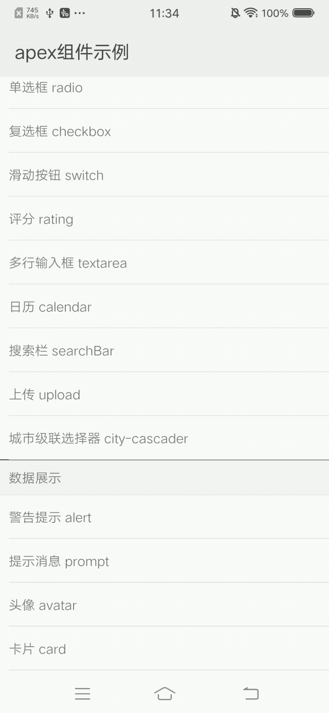

## 城市级联选择器 city-cascader

### 描述

城市级联选择器，用于选中所在地区，包括省市区三级

### 使用效果

<div style="text-align: center; margin: 40px; "></div>

### 使用方法

在 `.ux` 文件中引入组件

``` html
<import name="my-city-cascader" src="apex-ui/components/city-cascader/index"></import>
```

### 示例

``` html
<template>
  <div class="wrap">
    <div class="line" onclick="handle1">
      <text class="left">默认(区县级)</text>
      <text class="right">{{text1}}</text>
    </div>
    <div class="line" onclick="handle2">
      <text class="left">市级</text>
      <text class="right">{{text2}}</text>
    </div>
    <div class="line" onclick="handle3">
      <text class="left">省级</text>
      <text class="right">{{text3}}</text>
    </div>
    <my-city-cascader id="cascader1" oncascader="cascader1"></my-city-cascader>
    <my-city-cascader id="cascader2" level="{{2}}" oncascader="cascader2" default="{{default}}"></my-city-cascader>
    <my-city-cascader id="cascader3" level="{{1}}" oncascader="cascader3"></my-city-cascader>
  </div>
</template>
```

``` less
.wrap {
  width: 100%;
  height: 100%;
  flex-direction: column;
  justify-content: center;
  align-items: center;

  .line {
    width: 680px;
    height: 80px;
    margin: 15px 30px;
    border: 1px solid #bbbbbb;
    border-radius: 10px;
    background-color: #eee;
    justify-content: space-between;
    .left {
      margin-left: 10px;
      color: #666666;
      font-size: 30px;
    }
    .right {
      width: 450px;
      height: 80px;
      line-height: 80px;
      margin-right: 10px;
      font-size: 30px;
      color: #ff2828;
      lines: 1;
      text-overflow: ellipsis;
      text-align: right;
    }
  }
}
```

``` javascript
export default {
  data: {
    result1: [],
    text1: '',
    result2: [],
    text2: '陕西省/咸阳市',
    result3: [],
    text3: '',
    default: {
      province: {
        label: '陕西省',
        value: '610000'
      },
      city: {
        'label': '咸阳市',
        'value': '610400'
      }
    }
  },

  handle1() {
    this.$child('cascader1').show()
  },

  cascader1(e) {
    this.result1 = []
    if (e.detail.province) {
      this.result1.push(e.detail.province)
    }
    if (e.detail.city) {
      this.result1.push(e.detail.city)
    }
    if (e.detail.area) {
      this.result1.push(e.detail.area)
    }
    this.text1 = `${this.result1[0].label}/${this.result1[1].label}${this.result1[2].label?'/':''}${this.result1[2].label?this.result1[2].label:''}`
  },

  handle2() {
    this.$child('cascader2').show()
  },

  cascader2(e) {
    this.result2 = []
    if (e.detail.province) {
      this.result2.push(e.detail.province)
    }
    if (e.detail.city) {
      this.result2.push(e.detail.city)
    }
    this.text2 = `${this.result2[0].label}/${this.result2[1].label}`
  },

  handle3() {
    this.$child('cascader3').show()
  },

  cascader3(e) {
    this.result3 = []
    if (e.detail.province) {
      this.result3.push(e.detail.province)
    }
    this.text3 = `${this.result3[0].label}`
  }
}
```

### API

#### 组件属性

| 属性    | 类型    | 默认值 | 说明                            |
|-------- |--------|-------|------------------------------- |
| level   | Number | 3     | 显示等级，1.省级；2.市级；3.区县级  |
| default | Obejct | {}    | 默认选中城市                     |

#### 组件事件

| 事件名称  | 事件描述     |
| -------- | ----------- |
| cascader | 选择完成触发  |

