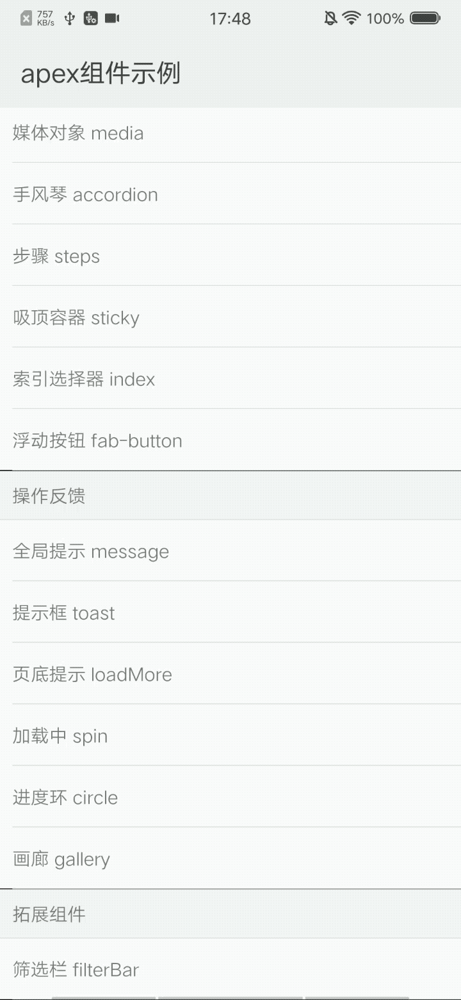

## 筛选栏 filterbar

### 描述

用于对数据进行筛选

### 使用效果

<div style="text-align: center;margin: 40px;"></div>

### 使用方法

在`.ux`文件中引入组件

```html
<import name="my-filterbar" src="apex-ui/components/filterbar/index"></import>
```

### 示例

```html
<template>
  <div>
    <my-filterBar items="{{items}}" onfilter="handleFilter"></my-filterBar>
  </div>
</template>
```

```javascript
<script>
export default {
  data: {
    items: [
      {
        type: 'radio',
        label: 'Updated',
        value: 'updated',
        checked: true,
        children: [{
          label: 'Recently updated',
          value: 'desc',
          checked: true, // 默认选中
        },
        {
          label: 'Least recently updated',
          value: 'asc',
        }],
      },
      {
        type: 'text',
        label: 'Forks',
        value: 'forks'
      },
      {
        type: 'sort',
        label: 'Stars',
        value: 'stars'
      },
      {
        type: 'filter',
        label: '筛选',
        value: 'filter',
        checked: true,
        children: [{
          type: 'radio',
          label: 'Languages（单选）',
          value: 'language',
          children: [{
            label: 'JavaScript',
            value: 'javascript',
          },
          {
            label: 'HTML',
            value: 'html',
          },
          {
            label: 'CSS',
            value: 'css',
          },
          {
            label: 'TypeScript',
            value: 'typescript',
          },
          ],
        },
        {
          type: 'checkbox',
          label: 'Query（复选）',
          value: 'query',
          checked: true,
          children: [{
            label: 'Angular',
            value: 'angular',
          },
          {
            label: 'Vue',
            value: 'vue',
          },
          {
            label: 'React',
            value: 'react',
            checked: true, // 默认选中
          },
          {
            label: 'Avalon',
            value: 'avalon',
          },
          ],
        },
        {
          type: 'checkbox',
          label: '配送方式',
          value: 'away',
          children: [{
            label: '京东配送',
            value: '1',
          },
          {
            label: '货到付款',
            value: '2',
          },
          {
            label: '仅看有货',
            value: '3',
          },
          {
            label: '促销',
            value: '4',
          },
          {
            label: '全球购',
            value: '5',
          },
          {
            label: 'PLUS专享价',
            value: '6',
          },
          {
            label: '新品',
            value: '7',
          },
          {
            label: '配送全球',
            value: '8',
          },
          ],
        },
        {
          type: 'radio',
          label: '性别',
          value: 'gander',
          children: [{
            label: '男',
            value: '0',
          },
          {
            label: '女',
            value: '1',
          },
          {
            label: '通用',
            value: '2',
          },
          ],
        },
        {
          type: 'checkbox',
          label: '闭合方式',
          value: 'closed_mode',
          children: [{
            label: '卡扣',
            value: '0',
          },
          {
            label: '拉链',
            value: '1',
          },
          {
            label: '其他',
            value: '2',
          },
          ],
        },
        {
          type: 'checkbox',
          label: '轮子种类',
          value: 'wheel_type',
          children: [{
            label: '万向轮',
            value: '0',
          },
          {
            label: '单向轮',
            value: '1',
          },
          {
            label: '飞机轮',
            value: '2',
          },
          {
            label: '其他',
            value: '3',
          },
          ],
        },
        {
          type: 'checkbox',
          label: '箱包硬度',
          value: 'wheel_type',
          children: [{
            label: '硬箱',
            value: '0',
          },
          {
            label: '软硬结合',
            value: '1',
          },
          {
            label: '软箱',
            value: '2',
          },
          {
            label: '其他',
            value: '3',
          },
          ],
        },
        {
          type: 'checkbox',
          label: '适用场景',
          value: 'wheel_type',
          children: [{
            label: '旅行',
            value: '0',
          },
          {
            label: '婚庆',
            value: '1',
          },
          {
            label: '出差',
            value: '2',
          },
          {
            label: '其他',
            value: '3',
          },
          ],
        },
        ],
      },
    ],
  },

  handleFilter(e) {
    console.log('barResult', JSON.parse(e.detail.barResult))
    console.log('sideResult', JSON.parse(e.detail.sideResult))
  }
}
</script>
```

### API

#### 组件属性

| 属性        | 类型    | 默认值 | 说明        |
| ----------- | ------ | ----- | ---------- |
| items       | Array  | []    | 筛选项      |
| confirmText | String | '确定' | 确定按钮文字 |
| cancelText  | String | '重置' | 取消按钮文字 |

#### items[]属性

| 属性     | 类型     | 默认值 | 说明                                 |
| -------- | ------- | ----- | ----------------------------------- |
| type     | String  | ''    | 筛选项类型，顶部筛选栏可为radio,text,sort,filter,侧边筛选框可为radio和checkbox |
| label    | String  | ''    | 筛选项描述 |
| value    | String  | ''    | 筛选项值   |
| children | Array   | []    | 子元素     |
| checked  | Boolean | false | 是否默认选中 |