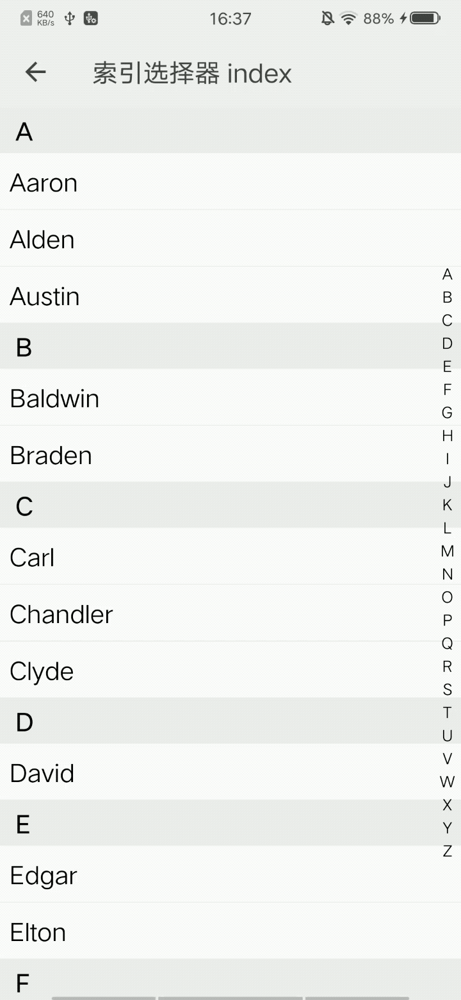

## 索引选择器 index

### 描述

用于在通讯录等场景中快速定位

### 使用效果

<div style="text-align: center;margin: 40px;"></div>

### 使用方法

在`.ux`文件中引入组件

```html
<import name="my-index" src="apex-ui/components/index/index.ux"></import>
<import name="my-index-item" src="apex-ui/components/index-item/index.ux"></import>
```

### 示例

```html
<template>
  <div>
    <my-index id="index1">
      <block for="{{ names in alphabet }}">
        <my-index-item group-id="index1" name="{{ names.initial }}">
          <div class="content" for="{{ name in names.cells }}"><text>{{ name }}</text></div>
        </my-index-item>
      </block>
    </my-index>
  </div>
</template>
```

```less
<style lang="less">
.content {
  padding: 20px 15px;
  border-bottom: 1px solid #eee;
  text {
    color: #000000;
    font-size: 40px;
  }
}
</style>
```

```javascript
<script>
const NAMES = ['Aaron', 'Alden', 'Austin', 'Baldwin', 'Braden', 'Carl', 'Chandler', 'Clyde', 'David', 'Edgar', 'Elton', 'Floyd', 'Freeman', 'Gavin', 'Hector', 'Henry', 'Ian', 'Jason', 'Joshua', 'Kane', 'Lambert', 'Matthew', 'Morgan', 'Neville', 'Oliver', 'Oscar', 'Perry', 'Quinn', 'Ramsey', 'Scott', 'Seth', 'Spencer', 'Timothy', 'Todd', 'Trevor', 'Udolf', 'Victor', 'Vincent', 'Walton', 'Willis', 'Xavier', 'Yvonne', 'Zack', 'Zane']

export default {
  data() {
    return {
      alphabet: [],
    }
  },

  onInit() {
    const alphabet = []
    'ABCDEFGHIJKLMNOPQRSTUVWXYZ'.split('').forEach((initial) => {
      const cells = NAMES.filter((name) => name.charAt(0) === initial)
      alphabet.push({
        initial,
        cells
      })
    })
    this.alphabet = alphabet
  }
}
</script>
```

### API

#### index组件属性

| 属性          | 类型     | 默认值 | 说明              |
| ------------- | ------- | ----- | ---------------- |
| id            | String  | ''    | index组件ID，必填 |
| showIndicator | Boolean | true  | 是否显示指示器     |

#### index-item组件属性

| 属性    | 类型    | 默认值 | 说明                    |
| ------- | ------ | ----- | ---------------------- |
| name    | String | ''    | 标题                   |
| groupId | String | ''    | 所属的index组件的ID，必填 |

#### index-item slot

| 名称    |描述       | 
| ------- | -------- | 
| default | 自定义内容 |