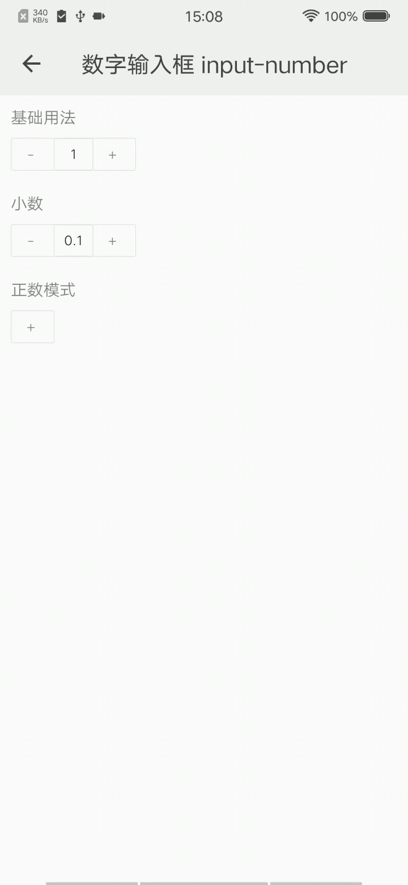

## 数字输入框 inputNumber

### 描述

表单组件，可以按指定标准输入和调整数字。

### 使用效果

<div style="text-align: center;margin: 40px;"></div>

### 使用方法

在`.ux`文件中引入组件

```html
<import name="my-input-number" src="@apex-quickapp/components/input-number/index"></import>
```

### 示例

```html
<template>
    <div class="wrap">
        <div class="panel">
            <text class="title">基础用法</text>
            <my-input-number min="0" max="100" onchange="changeHandler1"></my-input-number>
        </div>
        <div class="panel">
            <text class="title">小数</text>
            <my-input-number min="0" max="100" step="0.2" onchange="changeHandler2"></my-input-number>
        </div>
    </div>
</template>
```

```less
.wrap {
    flex-direction: column;
    background-color: #f7f7f7;
    .title {
        margin: 20px;
    }
}
```

```javascript
export default {
    data() {
        return {
            value1: 1,
            value2: 0.1
        }
    },
    changeHandler1({detail}) {
        console.log('number changed', detail);
        this.value1 = detail.value;
    },
    changeHandler2({detail}) {
        console.log('number changed', detail);
        this.value2 = detail.value;
    }
}
```

### API

#### 组件属性

| 属性  | 类型   | 默认值 | 说明             |
| ----- | ------ | ------ | ---------------- |
| value | Number | 1      | 初始值           |
| min   | Number | -      | 允许的最小值     |
| max   | Numbe  | -      | 允许的最大值     |
| step  | Number | 1      | 每次调整变化的值 |

#### 组件事件

| 事件名称 | 事件描述         | 返回值                    |
| -------- | ---------------- | ------------------------- |
| change   | 值发生变化的事件 | {value:value}发生变化的值 |