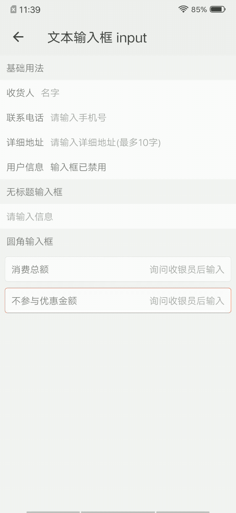

## 文本输入框 input

### 描述

表单组件，在原生的基础上做了一些拓展，更加美观和方便。

### 使用效果

<div style="text-align: center;margin: 40px;"></div>

### 使用方法

在`.ux`文件中引入组件

```html
<import name="my-input" src="apex-ui/components/input/index"></import>
```

### 示例

```html
<template>
    <div class="wrap">
        <text class="title">基础用法</text>
        <my-input value="{{ value1 }}" title="收货人" autofocus="true" placeholder="名字"></my-input>
        <my-input value="{{ value2 }}" type="number" title="联系电话" placeholder="请输入手机号"></my-input>
        <my-input value="{{ value3 }}" type="textarea" title="详细地址" placeholder="请输入详细地址(最多10字)" maxlength="10"></my-input>
        <my-input value="{{ value4 }}" title="用户信息" disabled="true"></my-input>
        <text class="title">无标题输入框</text>
        <my-input value="{{ value5 }}" placeholder="请输入信息"></my-input>
        <text class="title">圆角输入框</text>
        <my-input value="{{ value6 }}" type="number" right="true" title="消费总额" mode="wrapped" placeholder="询问收银员后输入"></my-input>
        <my-input value="{{ value7 }}" type="number" right="true" error="true" title="不参与优惠金额" mode="wrapped" placeholder="询问收银员后输入"></my-input>
    </div>
</template>
```

```less
.wrap {
    flex-direction: column;
    background-color: #f7f7f7;
    .title {
        margin: 20px;
    }
}
```

```javascript
export default {
    data() {
        return {
            value1: '',
            value2: '',
            value3: '',
            value4: '输入框已禁用',
            value5: '',
            value6: '',
            value7: ''
        }
    }
}
```

### API

#### 组件属性

| 属性        | 类型    | 默认值 | 说明                                |
| ----------- | ------- | ------ | ----------------------------------- |
| title       | String  | -      | 输入框标题                          |
| type        | String  | -      | 输入框类型                          |
| value       | String  | -      | 输入框默认值                        |
| disabled    | Boolean | false  | 是否禁用                            |
| placeholder | String  | -      | 占位提示文字                        |
| autofocus   | Boolean | false  | 自动获取焦点，拉起输入法            |
| right       | Boolean | false  | 输入框内容是都靠右显示              |
| mode        | String  | normal | 输入框样式，可选值有wrapped，normal |
| error       | Boolean | false  | 输入框内容错误样式                  |
| maxlength   | Number  | -      | 最大输入长度                        |

#### 组件事件

| 事件名称 | 事件描述           | 返回值 |
| -------- | ------------------ | ------ |
| change   | 值发生变化的事件   | event  |
| focus    | 获得焦点发生的事件 | event  |
