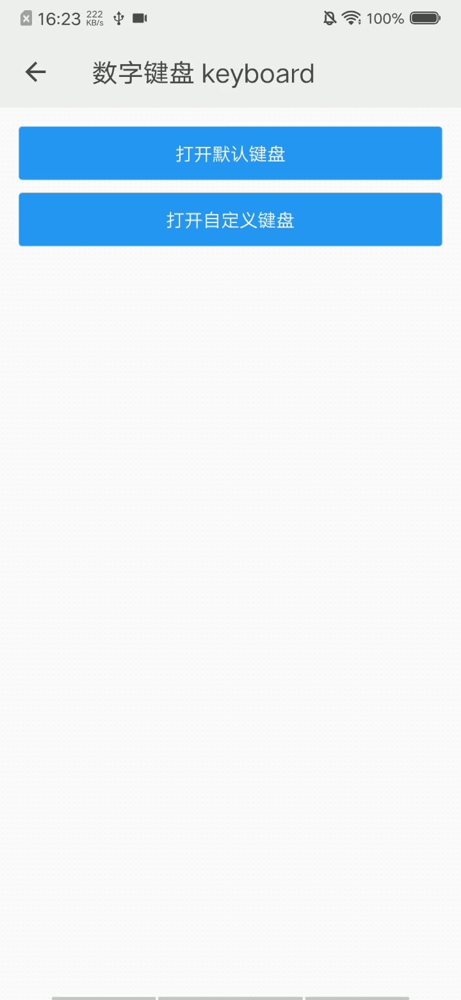

## 数字键盘 keyboard

### 描述

用于展现数字键盘。

### 使用效果

<div style="text-align: center;margin: 40px;"></div>

### 使用方法

在`.ux`文件中引入组件

```html
<import name="my-keyboard" src="apex-ui/components/keyboard/index"></import>
```

### 示例

```html
<template>
    <div class="wrap">
        <my-button ontap="showKeyboard('keyboard')">打开默认键盘</my-button>
        <my-button ontap="showKeyboard('keyboard1')">打开自定义键盘</my-button>
        <my-keyboard id="keyboard"></my-keyboard>
        <my-keyboard id="keyboard1" disorder="{{true}}" maxlength="8" title="我的密码" info="数字键盘" oncomplete="verify()"></my-keyboard>
    </div>
</template>
```

```less
.wrap {
    padding: 20px;
    flex-direction: column;
}
```

```javascript
import prompt from '@system.prompt';

export default {
    data() {
        return {}
    },
    showKeyboard(key) {
        this.$child(key).show()
    },
    verify(e) {
        const password = e.detail.numbers.join('');
        prompt.showToast({
            message: '我的密码是：' + password
        })
    }
}
```

### API

#### 组件属性

| 属性       | 类型    | 默认值       | 说明                         |
| ---------- | ------- | ------------ | ---------------------------- |
| password   | Boolean | true         | 是否密码类型                 |
| disorder   | Boolean | false        | 是否打乱键盘                 |
| title      | String  | 输入数字密码 | 键盘标题                     |
| info       | String  | 安全键盘     | 键盘提示文本                 |
| cancelText | String  | 取消         | 取消按钮文本                 |
| deleteText | String  | 删除         | 删除按钮文本                 |
| maxlength  | Number  | 6            | 输入最大长度，值为-1时无限长 |

#### 组件事件

| 事件名称 | 事件描述               | 返回值            |
| -------- | ---------------------- | ----------------- |
| change   | 键盘值值发生变化的事件 | {numbers:numbers} |
| complete | 键盘完整输入触发的事件 | {numbers:numbers} |
| close    | 关闭键盘触发的事件     | {numbers:numbers} |
| cancel   | 点击取消按钮触发的事件 | {numbers:numbers} |
