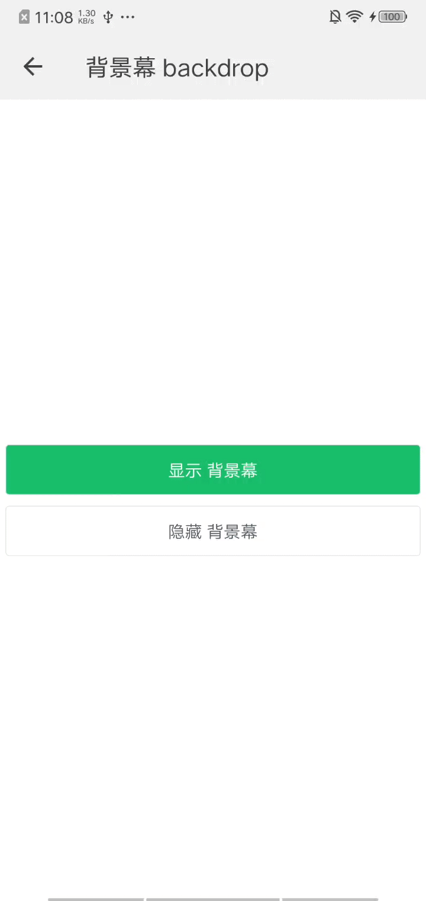

## 背景幕 mask

### 描述

在组件中设置显示蒙层。

### 使用效果

<div style="text-align: center;margin: 40px;"></div>

### 使用方法

在`.ux`文件中引入组件

```html
<import name="my-mask" src="apex-ui/components/mask/index"></import>
```

### 示例

```html
<template>
  <div class="wrap">
    <my-mask id="mask"></my-mask>

    <my-button type="success" ontap="handleClickShow">显示 背景幕</my-button>
    <my-button type="ghost" ontap="handleClickHide">隐藏 背景幕</my-button>
  </div>
</template>
```

```less
.wrap {
  flex-direction: column;
  justify-content: center;
  .text-center{
    text-align: center;
    font-size: 40px;
    margin-top: 30px;
  }
}
```

```javascript
export default {
  data() {
    return {}
  },
  handleClickShow(){
    this.$child('mask').show()
  },
  handleClickHide(){
    this.$child('mask').hide()
  }
} 
```

### API

#### 组件属性

| 属性        | 类型    | 默认值 | 说明              |
| ----------- | ------- | ----- | ----------------- |
| animation   | Boolean | true | 是否开启动画        |
| transparent | Boolean | false | 是否显示透明蒙层   |
| zIndex      | Number  | 1000  | 设置蒙层的 z-index |

#### 组件事件

| 事件名称 | 事件描述 | 返回值 |
| ------- | ------- | ------ |
| show    | 显示蒙层 | -      |
| hide    | 隐藏蒙层 | -      |
