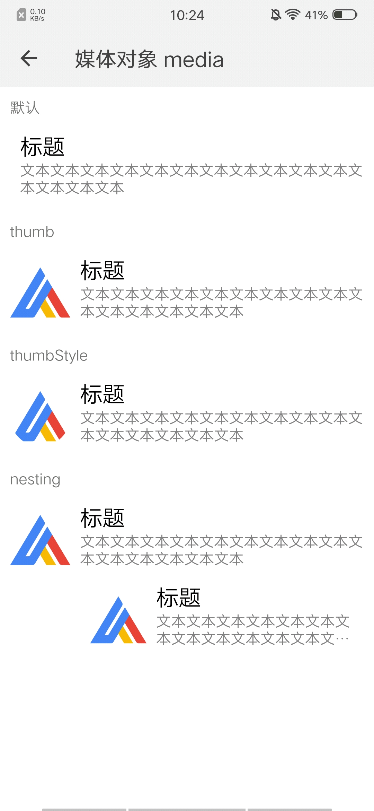

## 媒体内容 media

### 描述

用于展示多媒体内容

### 使用效果

<div style="text-align: center;margin: 40px;"></div>

### 使用方法

在`.ux`文件中引入组件

```html
<import name="my-media" src="apex-ui/components/media/index"></import>
```

### 示例

```html
<template>
  <div class="wrap">
    <text class="title">默认</text>
    <my-media title="标题" label="文本文本文本文本文本文本文本文本文本文本文本文本文本文本文本"></my-media>
    <text class="title">thumb</text>
    <my-media thumb="../../images/logo-d.png" title="标题" label="文本文本文本文本文本文本文本文本文本文本文本文本文本文本文本"></my-media>
    <text class="title">thumbStyle</text>
    <my-media thumb="../../images/logo-d.png" thumb-style="border-radius:150px;" title="标题" label="文本文本文本文本文本文本文本文本文本文本文本文本文本文本文本"></my-media>
    <text class="title">nesting</text>
    <my-media thumb="../../images/logo-d.png" title="标题" label="文本文本文本文本文本文本文本文本文本文本文本文本文本文本文本">
      <my-media thumb="../../images/logo-d.png" title="标题" label="文本文本文本文本文本文本文本文本文本文本文本文本文本文本文本"></my-media>
    </my-media>
  </div>
</template>
```

```less
<style lang="less">

.wrap {
  flex-direction: column;

  .title {
    margin: 20px;
  }
}
</style>
```

### API

#### 组件属性

| 属性        | 类型     | 默认值 | 说明      |
| ---------- | ------- | ----- | -------- |
| thumb      | String  | ''    | 图片地址   |
| thumbStyle | String  | ''    | 图片样式   |
| title      | String  | ''    | 标题内容   |
| label      | String  | ''    | 小标题内容 |

#### slot

| 名称     | 描述        | 
| ------- | ----------- | 
| default | nesting内容 |
