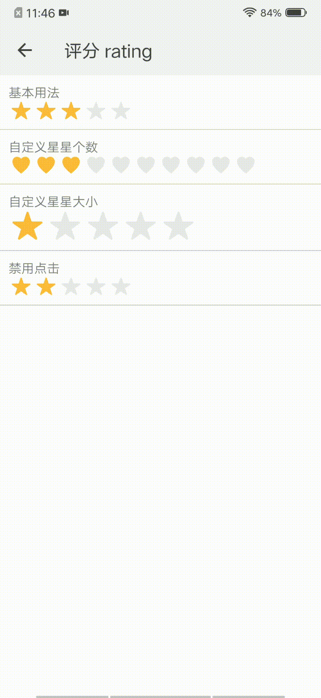

## 评分 rating

### 描述

对事物进行快速的评级操作，或对评价进行展示。

### 使用效果

<div style="text-align: center;margin: 40px;"></div>

### 使用方法

在`.ux`文件中引入组件

```html
<import name="my-rating" src="apex-ui/components/rating/index"></import>
```

### 示例

```html
<template>
    <div class="wrap">
        <div class="line">
            <text>基本用法</text>
            <my-rating icon="&#xe912;" value="3" onchange="changeHandler"></my-rating>
        </div>
        <div class="line">
            <text>自定义星星个数</text>
            <my-rating icon="&#xe941;" count="10" value="3" onchange="changeHandler"></my-rating>
        </div>
        <div class="line">
            <text>自定义星星大小</text>
            <my-rating icon="&#xe912;" size="80" value="1" onchange="changeHandler"></my-rating>
        </div>
        <div class="line">
            <text>禁用点击</text>
            <my-rating icon="&#xe912;" disabled="true" value="2"></my-rating>
        </div>
    </div>
</template>
```

```less
.wrap {
    flex-direction: column;
    .line {
        flex-direction: column;
        border-bottom-color: #bbbec4;
        border-bottom-width: 1px;
        width: 100%;
        padding: 20px;
    }
}
```

```javascript
export default {
    changeHandler(e) {
        console.log(`点击了评分，目前分数是${e.detail}!`);
    }
}
```

### API

#### 组件属性

| 属性        | 类型    | 默认值    | 说明                                                         |
| ----------- | ------- | --------- | ------------------------------------------------------------ |
| count       | Number  | 5         | 评分的最大分数                                               |
| icon        | String  | "&#xe912" | 图标的样式，值可以为`icon`组件的html实体值，也可为任意字符串 |
| starColor   | String  | "#e8e8e8" | 图标的颜色                                                   |
| activeColor | String  | "#fdba3b" | 选中后的颜色                                                 |
| size        | Number  | 50        | 图标大小                                                     |
| margin      | Number  | 4         | 评分组件的外边距                                             |
| value       | Number  | 0         | 当前的评分值                                                 |
| disabled    | Boolean | false     | 是否禁用                                                     |

#### 组件事件

| 事件名称 | 事件描述         | 返回值            |
| -------- | ---------------- | ----------------- |
| change   | 值发生变化的事件 | 当前的评分值value |
