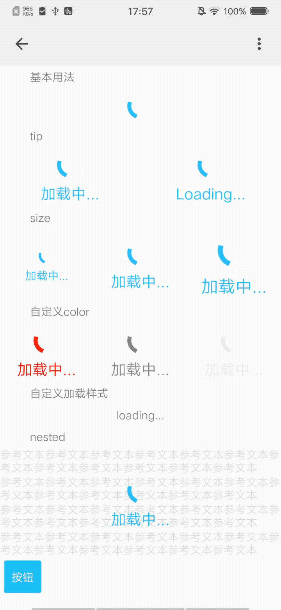

## 加载中 spin

### 描述

用于表示资源正在加载中

### 使用效果

<div style="text-align: center;margin: 40px;"></div>

### 使用方法

在`.ux`文件中引入组件

```html
<import name="my-spin" src="apex-ui/components/spin/index"></import>
```

### 示例

```html
<template>
  <div class="wrap">
    <text class="title">基本用法</text>
    <div class="group">
      <my-spin ></my-spin>
    </div>
    <text class="title">tip</text>
    <div class="group">
      <my-spin tip="加载中..."></my-spin>
      <my-spin tip="Loading..."></my-spin>
    </div>
    <text class="title">size</text>
    <div class="group">
      <my-spin size="small" tip="加载中..."></my-spin>
      <my-spin tip="加载中..."></my-spin>
      <my-spin size="large" tip="加载中..."></my-spin>
    </div>
    <text class="title">自定义color</text>
    <div class="group">
      <my-spin tip="加载中..." color="red"></my-spin>
      <my-spin tip="加载中..." color="rgba(0,0,0,0.5)"></my-spin>
      <my-spin tip="加载中..." color="#eee"></my-spin>
    </div>
    <text class="title">自定义加载样式</text>
    <div class="group">
      <my-spin>
        <div slot="custom">
          <text>loading...</text>
        </div>
      </my-spin>
    </div>
    <text class="title">nested</text>
    <div style="flex-direction: column;">
      <my-spin tip="加载中..." nested="{{true}}" loading="{{loading}}">
        <div slot="nested" style="flex-direction: column;">
          <text>参考文本参考文本参考文本参考文本参考文本参考文本参考文本参考文本参考文本参考文本参考文本参考文本</text>
          <text>参考文本参考文本参考文本参考文本参考文本参考文本参考文本参考文本参考文本参考文本参考文本参考文本</text>
          <text>参考文本参考文本参考文本参考文本参考文本参考文本参考文本参考文本参考文本参考文本参考文本参考文本</text>
          <text>参考文本参考文本参考文本参考文本参考文本参考文本参考文本参考文本参考文本参考文本参考文本参考文本</text>
        </div>
      </my-spin>
      <my-button type="info" inline="true" onclick="changeLoading">按钮</my-button>
    </div>
  </div>
</template>
```

```less
<style lang="less">
.wrap {
  flex-direction: column;
  .title{
    padding: 10px 80px;
  }
  .group {
    flex-direction: row;
    justify-content: space-around;
    margin: 10px 0;
  }
}
</style>
```

```javascript
<script>
export default {
  data(){
    return {
      loading: true
    }
  },
  
  changeLoading(){
    this.loading = !this.loading
  }
}
</script>
```

### API

#### 组件属性

| 属性     | 类型    | 默认值   | 说明                                   |
| -------- | ------- | ------- | ------------------------------------ |
| tip     | String  | -       | 加载时文字信息                          |
| color   | String  | #33b4ff | 组件颜色                               |
| loading | Boolean | true    | 是否显示加载中组件                      |
| nested  | Boolean | false   | 是否包含内容                           |
| size    | String  | default | 组件大小，可选值有large, default, small |
| custom  | Boolean | false   | 是否使用自定义加载中样式, 使用custom slot时需设置为true |

#### slot

| 名称    | 描述              | 
| ------ | ---------------- | 
| custom | 自定义加载中组件样式 | 
| nested | 组件包含内容       | 
