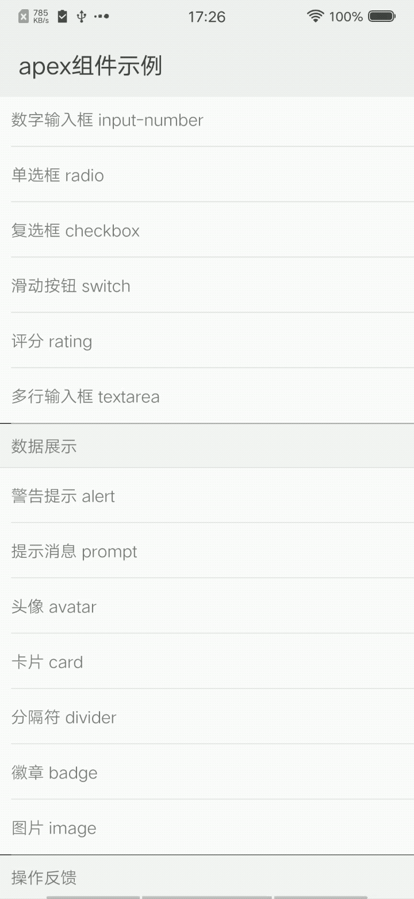

## 多行输入框 textarea

### 描述

多行输入框，用于输入多行文本

### 使用效果

<div style="text-align: center;margin: 40px;"></div>

### 使用方法

在`.ux`文件中引入组件

```html
<import name="my-textarea" src="apex-ui/components/textarea/index"></import>
```

### 示例

```html
<template>
  <div class="wrap">
    <text class="title">基础用法</text>
    <div class="group">
      <div class="cell">
        <my-textarea placeholder="请输入内容"></my-textarea>
      </div>
      <div class="cell">
        <my-textarea label="label" placeholder="请输入内容"></my-textarea>
      </div>
      <div class="cell">
        <my-textarea label="label" placeholder="请输入内容" rows="{{3}}"></my-textarea>
      </div>
    </div>
    <text class="title">focus</text>
    <div class="group">
      <div class="cell">
        <my-textarea label="label" placeholder="请输入内容" focus="{{true}}"></my-textarea>
      </div>
    </div>
    <text class="title">count</text>
    <div class="group">
      <div class="cell">
        <my-textarea placeholder="请输入内容" rows="{{3}}" has-count="{{true}}"></my-textarea>
      </div>
    </div>
    <text class="title">clear</text>
    <div class="group">
      <div class="cell">
        <my-textarea label="label" placeholder="请输入内容" clear="{{true}}" default-value="文本"></my-textarea>
      </div>
    </div>
    <text class="title">disabled</text>
    <div class="group">
      <div class="cell">
        <my-textarea label="label" placeholder="请输入内容" default-value="undisabled"></my-textarea>
      </div>
      <div class="cell">
        <my-textarea label="label" placeholder="请输入内容" disabled="{{true}}" default-value="disabled"></my-textarea>
      </div>
    </div>
    <text class="title">extra</text>
    <div class="group">
      <div class="cell">
        <my-textarea label="Dollar" extra="$" default-value="1024"></my-textarea>
      </div>
      <div class="cell">
        <my-textarea label="RMB" extra="¥" default-value="1024"></my-textarea>
      </div>
    </div>
    <text class="title">slot</text>
    <div class="group">
      <div class="cell">
        <my-textarea placeholder="请输入内容">
          <div slot="label" style="padding-right:50px;">
            <my-icon type="paper-plane" size="50"></my-icon>
          </div>
        </my-textarea>
      </div>
      <div class="cell">
        <my-textarea placeholder="请输入内容">
          <my-icon type="cut" size="50" slot="extra"></my-icon>
        </my-textarea>
      </div>
    </div>
  </div>
</template>
```

```less
<style lang="less">
@import '~apex-ui/components//styles/base.less';

.wrap {
  flex-direction: column;
  background-color: @background-color-base;

  .title {
    margin: 20px;
  }

  .group{
    flex-direction: column;
    background-color: #ffffff;
    border-bottom: 1px solid #eee;
    border-top: 1px solid #eee;
    
    .cell{
      margin-left: 20px;
      padding: 20px 0;
      border-bottom: 1px solid #eee;
    }
  }
}
</style>
```

### API

#### 组件属性

| 属性          | 类型     | 默认值 | 说明                  |
| ------------ | ------- | ----- | --------------------- |
| label        | String  | ''    | 左侧内容                |
| extra        | String  | ''    | 右侧内容                |
| defaultValue | String  | ''    | 内容默认值              |
| disabled     | Boolean | false | 是否禁用                |
| placeholder  | String  | ''    | 占位提示文字             |
| focus        | Boolean | false | 自动获取焦点，拉起输入法   |
| rows         | Number  | 1     | 输入框行数              |
| clear        | Boolean | false | 是否显示快速清除按钮      |
| hasCount     | Boolean | false | 是否显示计数功能         |
| maxlength    | Number  | 140   | 最大输入长度,-1为不限长度 |

#### 组件事件

| 事件名称         | 事件描述       | 返回值 |
| -------------- | ------------- | ----- |
| textareaChange | 值发生变化的事件 | event |

#### slot

| slot名称 | 描述         |
|-------- | ------------ |
| label   | 自定义左侧内容 |
| extra   | 自定义右侧内容 |
