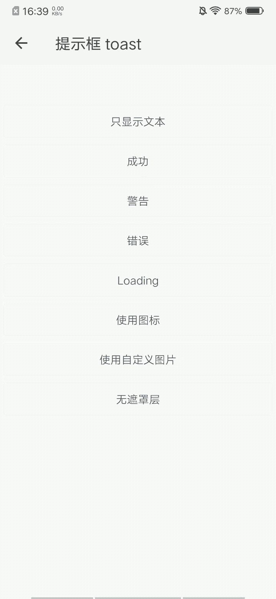

## 提示框 toast

### 描述

一种轻量级反馈/提示，可以用来显示不会打断用户操作的内容，适合用于页面转场、数据交互的等场景中。

### 使用效果

<div style="text-align: center;margin: 40px;"></div>

### 使用方法

在`.ux`文件中引入组件

```html
<import name="my-toast" src="apex-ui/components/toast/index"></import>
```

### 示例

```html
<template>
  <div class="wrap">
    <my-button type="ghost" ontap="handleText">只显示文本</my-button>
    <my-button type="ghost" ontap="handleSuccess">成功</my-button>
    <my-button type="ghost" ontap="handleWarning">警告</my-button>
    <my-button type="ghost" ontap="handleError">错误</my-button>
    <my-button type="ghost" ontap="handleLoading">Loading</my-button>
    <my-button type="ghost" ontap="handleIcon">使用图标</my-button>
    <my-button type="ghost" ontap="handleImage">使用自定义图片</my-button>
    <my-button type="ghost" ontap="handleMask">无遮罩层</my-button>

    <my-toast id="toast"></my-toast>
  </div>
</template>
```

```less
.wrap {
    flex-direction: column;
    padding-top: 100px;
}
```

```javascript
export default {
    handleText() {
        this.$child('toast').showToast({
            content: '这是文本提示'
        });
    },
    handleSuccess() {
        this.$child('toast').showToast({
            content: '成功的提示',
            type: 'success'
        });
    },
    handleWarning() {
        this.$child('toast').showToast({
            content: '警告的提示',
            type: 'warning'
        });
    },
    handleError() {
        this.$child('toast').showToast({
            content: '错误的提示',
            type: 'error'
        });
    },
    handleLoading() {
        this.$child('toast').showToast({
            content: '加载中',
            type: 'loading'
        });
    },
    handleIcon() {
        this.$child('toast').showToast({
            content: '使用内置的图标',
            icon: 'thumbs-up'
        });
    },
    handleImage() {
        this.$child('toast').showToast({
            content: '使用自定义图片',
            image: 'https://quickapp.vivo.com.cn/content/images/size/w1000/2019/03/quickapp-logo-4.png'
        });
    },
    handleMask() {
        const _this = this;
        this.$child('toast').showToast({
            content: '5秒后自动关闭',
            icon: 'woman',
            duration: 0,
            mask: false
        });
        setTimeout(() => {
            _this.$child('toast').hideToast();
        }, 5000);
    },
}
```

### API

#### 组件参数-option

| 属性     | 类型    | 默认值  | 说明                                                         |
| -------- | ------- | ------- | ------------------------------------------------------------ |
| content  | String  | -       | 提示的内容                                                   |
| icon     | String  | -       | 提示显示的图标，值为图标库中图标的type                       |
| image    | String  | -       | 图示显示的图片，支持网络图片                                 |
| duration | Number  | 2       | 显示持续的时间                                               |
| mask     | Boolean | true    | 是否显示遮罩层，点击遮罩层可关闭提示                         |
| type     | String  | default | 提示类型，可选值有default 、success 、warning 、error 、loading |

#### 组件方法

| 方法名称          | 事件描述 | 参数   |
| ----------------- | -------- | ------ |
| showToast(option) | 显示提示 | option |
| hideToast()       | 隐藏提示 | -      |

